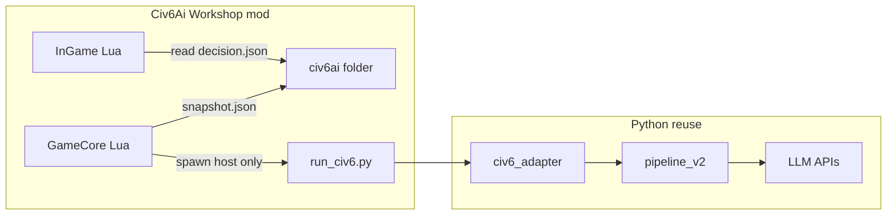

# Civ VI LLM AI — Implementation Plan

Build spec companion to [civ6-llm-ai-research.md](civ6-llm-ai-research.md). Command + prompt TDD: [civ6-command-prompt-spec.md](civ6-command-prompt-spec.md).

## 1. Product scope

- **SP complete first**, then **LAN MP** (desktop host + laptop client).
- **Hybrid control** (not full micro): native AI moves unmoved units; auto production unless LLM overrides; `fortify`/`sleep`/`alert` opts out.
- **No trade counteroffer** — accept/reject only.
- **Workshop Lua mod + `pipeline_v2` sidecar** — file bridge only (no external debug TCP).
- **Chat is v1** — `chat.all` / `chat.{Leader}` wire + InGame overlay (Civ IV parity). Not deferred.
- **Autotest is v1** — auto-advance, full I/O capture, apply-result logs, context-size metrics, multi-seat multi-turn analysis.
- Optional Real Strategy / Community Extension **not bundled** (see research §5.8).

---

## 0. Plan audit (2026-08-17)

### 0.1 Simplicity

**Verdict: mostly yes, with two simplifications required.**

Keep: one sidecar (`pipeline_v2`), one Workshop mod, closed-world `legal_commands`, hybrid native fallback, accept/reject trade (no counteroffer state machine).

Drop / collapse:

| Too much | Simpler |
|----------|---------|
| 18+ Lua files (Init, Config, Ids, ProbeRef, LegalCommandsInGame, five Apply* files) | **6 Lua files**: GameCore, Snapshot, Legal, Bridge, Apply, Chat overlay |
| Snapshot in GameCore + legal probes in InGame via `ExposedMembers` | **Build the whole snapshot in InGame on the host** at `PlayerTurnStartComplete`. GameCore only registers events. This avoids the Real Strategy GameCore→UI desync pattern. |
| Duplicate civ6-mcp as `ProbeRef.lua` | Copy the few `CanStart*` snippets into Legal/Apply; do not maintain a parallel MCP clone |
| Separate `decision-output-civ6.json` | Reuse `decision-output-v2.json` |
| `skip_remaining_units` before AI | Never — leftover moves are the fallback |

Do **not** add: second planner, MCP at runtime, Community Extension, per-kind Lua file.

### 0.2 Completeness vs stated requirements

| # | Requirement | Plan status | Gap to close |
|---|-------------|-------------|--------------|
| 1 | Full fog-filtered snapshot | Snapshot + adapter | Must include pending trades, blockers, districts, loyalty — not only units/cities |
| 2 | Map image in prompt | `map_render_civ6.py` | Attach via existing `pipeline_v2` image path; hex + `IsRevealed` mask |
| 3 | LLM trade request / perceive / respond | propose + pending in snapshot + accept/reject | **Disable civ6-mcp-style auto-accept** for managed seats. Counteroffer out of scope (reject + new `propose_trade` is enough) |
| 4 | Multiplayer compatible | Host-only sidecar, InGame apply, identical mod | See §0.5 seat-type risk |
| 5 | Deterministic unit fallback | Native AI leftover moves | Seat type must allow Firaxis **unit** AI without wiping LLM **city** orders |
| 6 | LLM can command units | `moveTo` / `attackTo` / worker ops in legal_commands | Cap move targets per unit (Civ IV 512 catalog) |
| 7 | Messages all / DM | **Was deferred — wrong** | **v1:** reuse `chat.*` wire; InGame overlay + network send |
| 8 | Context efficiency | Implied via `pipeline_v2` | **Explicit:** compact units (≥6), compact cities (≥10), recent chats only, `thought.situation/strategy`, `opinion.*`, `history.*` |
| 9 | Must not crash | Gates 0–5 | Sidecar **timeout → empty apply → native fallback**; pcall apply; never block the engine forever |
| 10 | Autotest from day one | Scripts named, not designed | **First-class:** autotest mode, journals, apply results, token counts, `civ6_autotest_analyze.py` |

Unstated but required (from Civ IV + Civ VI engine):

- Circuit breaker / model timeout (already in `pipeline_v2`)
- Thought memory files per leader (already in pipeline)
- Personality fixtures for **Civ VI leaders** (Civ IV JSON will not map)
- End-turn **blockers** (governor, policy, pantheon, WC) must appear as legal_commands or host-auto
- Save/load: memory + chat history survive reload
- `legal_commands` max 512

### 0.3 Stability and performance

| Issue | Plan effect | Mitigation |
|-------|-------------|------------|
| **Firaxis overwrites LLM production** on AI seats | Hybrid production may be a no-op | Gate 2 test: set production, let AI run, re-read queue. If overwritten: re-apply LLM production **after** city AI, or mark managed seats so city AI skips them |
| **GameCore calling InGame APIs** | Desync (RST issue #26) | Snapshot+apply **InGame only** on host |
| **`GetLocalPlayer()` apply** | Breaks LAN (laptop human) | Always `playerID` from the turn event |
| **Sidecar wait stalls the game** | Hang / MP kick | Hard timeout → log + native fallback (same as Civ IV circuit breaker) |
| **`legal_commands` explosion** (every move tile) | Token blowup, 512 cap drop | Compact wire: `moveTo = (x,y) \| ...` capped K per unit; image carries geography |
| **Blocking popups / diplo sessions** | Silent failed apply | Snapshot `pending_diplomacy`; host dismiss or `respond_to_diplomacy` in legal_commands |
| **Lua `io` / spawn from GameCore** | May be restricted | File bridge + spawn from **InGame** (civ6-mcp pattern) |
| **Sequential multi-LLM** | Long wall-clock turns | Prefetch optional later; v1 sequential is OK if timeout is bounded |
| **OneDrive `Documents` path** | File lock / delayed write | Prefer non-OneDrive `My Games` if present (Civ IV already does this) |

Native fallback **mitigates** LLM timeout and missing unit orders. It **creates** a two-brain conflict if city AI also runs.

### 0.4 Civ IV capability match

| Civ IV | Civ VI plan | Match? |
|--------|-------------|--------|
| Fog snapshot + legal_commands | Yes | Yes |
| Flat wire + thought / opinion / history | Reuse `pipeline_v2` | Yes if adapter preserves those fields |
| Compact units/cities | Reuse thresholds | Yes — must not strip in civ6_wire |
| Minimap PNG | `map_render_civ6` hex | Yes |
| Chat all / team / DM + overlay | Was deferred | **Must add** |
| Trade propose / pending / respond | Yes; no counteroffer | Acceptable (simpler than Civ IV) |
| `cancel_deal` | v1 add | Yes |
| AdvCiv tactical fill | Firaxis leftover moves | Analogous, not identical |
| Circuit breaker | Reuse | Yes |
| Autotest / live autoplay | Named scripts only | **Must design** (req 10) |
| Commerce sliders / war plans / espionage weights | N/A in Civ VI | N/A |
| Districts, governors, civics, WC | Civ VI extras | Plan has them |

### 0.5 Wide-angle issues (previously under-specified)

1. **Seat type is the load-bearing design.** civ6-mcp drives a **human** local player, so Firaxis city/unit AI does not fight it. Our LLM majors in MP are normally **AI players**. If they stay AI: unit fallback works, production/research AI may undo LLM. If we convert them to human: unit fallback may **not** run unless we autoplay leftover units ourselves. **Gate 2 must decide this empirically** before more architecture.

2. **Chat has no Civ VI DLL.** Civ IV added a synced chat log in the DLL. Civ VI needs UI Lua + `Network.SendChat` (or equivalent) on host, replayed to clients. Overlay is UX; network send is the MP requirement.

3. **InGame-only APIs.** `UnitManager.CanStartOperation` / `CityManager` are InGame. A GameCore snapshot cannot legally probe moves. Hence: host InGame snapshot, not a two-VM split.

4. **War-same-turn attacks fail** (`NO_ENEMY` until next turn). Prompt already notes this; apply layer must not retry-loop.

5. **World Congress and governor blockers** stall auto-end-turn. Autotest mode must auto-resolve or advertise them every time they block.

6. **Personality pack.** New `fixtures/civ6/` leader files; do not reuse Alexander-as-Civ-IV-Greece blindly.

7. **Analysis is offline.** Do not put a dashboard in the hot path. Journals + `civ6_autotest_analyze.py` is enough (command counts, apply failures, token sizes, extracted thought/strategy per player).

## 2. Architecture (3 components)



| Component | Role |
|-----------|------|
| **GameCore** | Turn hooks, snapshot, `legal_commands` probe, spawn sidecar, native AI fallback trigger |
| **InGame** | Apply validated commands (`UnitManager`, `CityManager`, `DealManager`) |
| **Sidecar** | Wire prompt, validation, journals, thought memory ([pipeline_v2.py](../sidecar/pipeline_v2.py)) |

## 3. Turn lifecycle

1. `PlayerTurnStartComplete` (managed seat)
2. Build snapshot + `legal_commands` → write `snapshot.json` → spawn `run_civ6.py`
3. Await `decision.json` → apply LLM commands (InGame)
4. **Native AI** unit phase for unmoved units
5. **Deterministic production** for cities still without queue
6. Host ends seat pulse (no LLM `end_turn`)

Seat config: `CIV6AI_MANAGED_SEATS`, `CIV6AI_HUMAN_SEATS`. Sidecar **host-only** even in SP.

## 4. Data contracts

| Artifact | Path | Schema |
|----------|------|--------|
| Snapshot | `My Games/.../civ6ai/sessions/{id}/snapshot.json` | `schemas/decision-input-civ6.json` (extends v2) |
| Decision | `.../decision.json` | `schemas/decision-output-v2.json` |
| Journal | `.../journal.jsonl` | same as Civ IV |
| Map PNG | `.../map.png` | attached to LLM like Civ IV |
| Personality | `fixtures/ai_player_*_personality.json` | reused |

Wire prompt: flat sections in [civ6-command-prompt-spec.md](civ6-command-prompt-spec.md).

## 5. Command catalog (v1)

Regenerate: `python scripts/testbed/generate_civ6_capabilities.py`

### Core (already in civ6-mcp)

Empire: research tech/civic, policies, government, dedication, pantheon, governors, envoy, diplomacy, trade propose/respond, peace, GP pool, WC votes.

City: `queue_production`, `purchase_item`, `purchase_tile`, `set_city_focus`, `city_attack`, capture resolve.

Unit: move, attack, postures, worker ops, settler, trader, GP activate, spy, promote, upgrade, etc.

### v1 additions (not in civ6-mcp today)

| kind | wire |
|------|------|
| `cancel_deal` | `legal.deal.cancel.{Leader} = ALLIANCE\|OPEN_BORDERS\|GPT\|...` |
| `clear_production_queue` | `{City}.clearQueue` |
| `remove_queue_order` | `{City}.removeQueueOrder` |
| `found_religion` | extended: worship + enhancer beliefs |
| `coastal_raid` | `{unit}.coastalRaid = (x,y)` |
| `pillage_improvement` | `{unit}.pillage = (x,y)` |
| `embark` / `disembark` | `{unit}.embark` / `disembark` |
| `rebase_aircraft` | `{unit}.rebase = (x,y)` |
| `wmd_strike` | `cmd.N` (risk=high) |
| `swap_units` | `{unit}.swapTo = (x,y)` |
| `rock_band_concert` | `{unit}.concert = (x,y)` |
| `archaeologist_excavate` | `{unit}.excavate` |
| `naturalist_national_park` | `{unit}.nationalPark = (x,y)` |
| `seaside_resort` | `{unit}.seasideResort = (x,y)` |

**Also v1 (Civ IV parity / requirements):**

| kind | wire |
|------|------|
| `chat` | `chat.all` / `chat.{Leader}` — social only; overlay + network send |
| (host) sidecar timeout | empty command list → native fallback |

**Out of scope:** `counteroffer_trade`, spy escape (host auto), citizen micro, builder auto-build, emergency event UI.

## 6. Testing gates

0. Mod no-op, 20+ turns  
1. Single command (research) + sidecar timeout fallback  
2. **Seat-type / hybrid:** production override vs Firaxis; leftover unit AI  
3. Multi-LLM trade (propose turn T, respond T+k; accept/reject only)  
4. Chat all + DM visible to human  
5. Autotest 50 turns: journals, apply-results, analyze.py report  
6. LAN MP smoke (desktop host + laptop)  

## 7. MP-aware SP rules

Host-only sidecar; InGame apply only; explicit seat `me`; no GameCore `UnitManager`; identical mod hash on clients; no auto-accept trades for LLM targets.

---

## 16. File manifest

Every path to **create** (or substantially new). Reuse marked.

### Workshop mod — `artifacts/Civ6Ai/` (keep this small)

```
artifacts/Civ6Ai/
  Civ6Ai.modinfo
  README.md
  Gameplay/
    Civ6Ai_GameCore.lua             # events only; no UnitManager / no files
  InGame/
    Civ6Ai_Config.lua               # seats, autotest, paths, timeouts
    Civ6Ai_Snapshot.lua             # fog snapshot + legal_commands (host InGame)
    Civ6Ai_Bridge.lua               # write snapshot, spawn run_civ6, await decision, timeout
    Civ6Ai_Apply.lua                # dispatch every kind (sections in one file until it hurts)
    Civ6Ai_Autotest.lua             # auto-advance, apply-result log, turn complete
    Civ6Ai_Chat.lua                 # overlay + send all/DM (v1)
```

**Reference:** probe/apply logic mirrors `artifacts/reference/civ6-mcp/src/civ_mcp/lua/*.py` builders.

### Python sidecar — extend repo `sidecar/`

```
sidecar/
  run_civ6.py                       # CLI entry (mirror run_v2.py); journals + token stats
  civ6_adapter.py                   # Snapshot ↔ v2 schema; preserves thought/opinion/history/chat
  civ6_wire.py                      # Compact wire + Civ VI instructions (reuse pipeline compact thresholds)
  map_render_civ6.py                # Hex fog minimap
  civ6_autotest_analyze.py          # Multi-turn / multi-AI report from journals
  tests/
    test_civ6_wire_prompt.py
    test_civ6_adapter.py
    test_civ6_capabilities.py
```

**Reuse (minimal edits):** `pipeline_v2.py`, `run_v2.py` patterns, `map_render.py` palettes/icons.

### Config & schemas

```
config/
  civ6-command-capabilities.json    # generated — all kinds + tiers
  civ6-command-probes.json          # probe API matrix per kind (from research §5.1)

schemas/
  decision-input-civ6.json          # extends v2: civ6 yields, districts, hex map
  decision-output-civ6.json         # extends v2 if needed (likely same as v2)
```

### Fixtures & TDD

```
fixtures/civ6/
  prompt-turn-classical-golden.txt
  response-turn-classical-golden.txt
  snapshot-turn-classical-golden.json   # minimal valid snapshot
  legal_commands-sample.json            # probe output sample

fixtures/                               # REUSE
  ai_player_*_personality.json
```

### Scripts & packaging

```
scripts/testbed/
  generate_civ6_capabilities.py
  Invoke-Civ6AiModSync.ps1
  Invoke-Civ6AiAutotest.ps1             # autotest mode: auto-advance + capture
  Invoke-Civ6AiAnalyze.ps1              # run civ6_autotest_analyze.py on a session
  Invoke-Civ6AiLanSmoke.ps1

scripts/
  Launch-Civ6Ai.cmd                     # optional desktop shortcut helper
```

### Docs & reference (exists)

```
docs/civ6-llm-ai-research.md
docs/civ6-command-prompt-spec.md
docs/civ6-map-coordinates.md
artifacts/reference/civ6-mcp/           # read-only upstream clone
```

### Runtime I/O (not in git)

```
%USERPROFILE%/Documents/My Games/Sid Meier's Civilization VI/
  Mods/Civ6Ai/                           # deployed mod copy
  civ6ai/
    host.env                             # API keys, seat manifest
    sessions/{session_id}/
      snapshot.json
      decision.json
      journal.jsonl                     # snapshot hash, prompt tokens, model I/O, cmds
      apply-results.jsonl               # per-command ok/err from Lua
      map.png
      stderr.log
    memory/{leader_id}.json
    autotest/                           # session summaries for analyze.py
```

### Implementation ownership map

| File(s) | Owner concern |
|---------|----------------|
| `Civ6Ai_Snapshot.lua`, `civ6_adapter.py` | Fog snapshot + legal_commands + pending trade |
| `civ6_wire.py`, golden `fixtures/civ6/*` | Prompt TDD + compact wire |
| `Civ6Ai_Apply.lua` | Every advertised `kind` |
| `Civ6Ai_Bridge.lua`, `run_civ6.py` | Spawn, timeout, circuit breaker |
| `Civ6Ai_Chat.lua` | chat.all / DM |
| `Civ6Ai_Autotest.lua`, `civ6_autotest_analyze.py` | Req 10 |
| `map_render_civ6.py` | Minimap PNG |

### Suggested build order

1. Config/schemas + generator + compact-wire tests (incl. chat lines)  
2. `civ6_adapter` + `run_civ6` fixture path (journal + token stats, no game)  
3. Mod skeleton: InGame snapshot stub + timeout fallback (Gate 0)  
4. **Seat-type experiment:** LLM production vs Firaxis city AI (decide human vs AI seats)  
5. Core apply: research, production, one unit move  
6. Trade propose/pending/respond (no auto-accept)  
7. Chat overlay + send  
8. Map PNG + remaining v1 kinds  
9. Autotest mode + `civ6_autotest_analyze.py`  
10. Gates 2–5 (SP soak, then LAN)  
