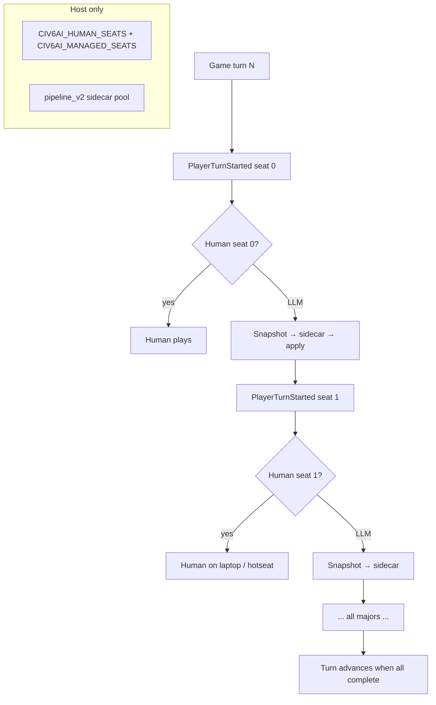
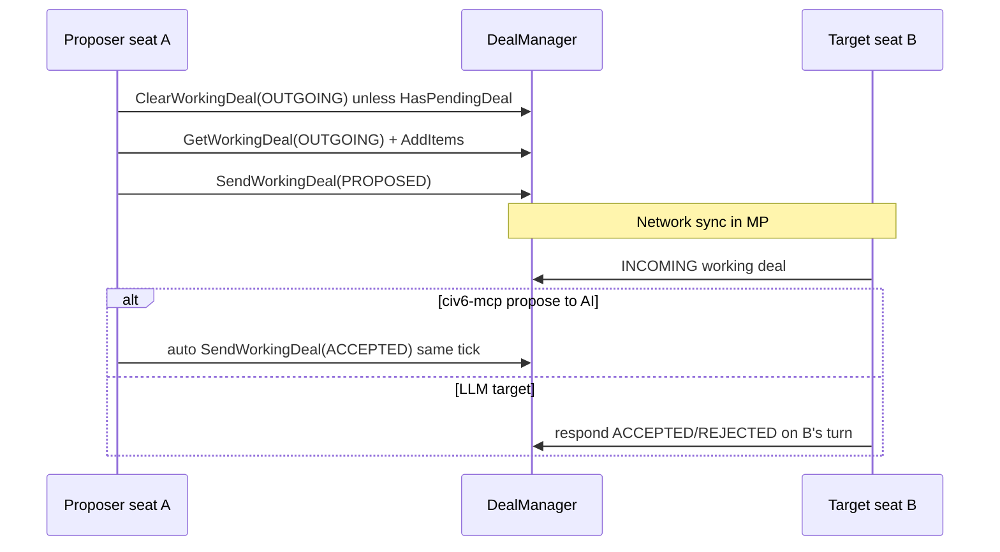

# Civ VI LLM AI — Research & Planning Document

**Status:** Research consolidated (Aug 2026)  
**Goal:** Port the Civ4AI architecture to **Civilization VI** with comparable strategic control, personality/memory, and optional native-AI fallback — starting with **single-player**, then evaluating multiplayer.

**Appendices (same content, split for navigation):** [spikes-01](./civ6-research-spikes-01.md) · [spikes-02](./civ6-research-spikes-02.md) · [map-coordinates](./civ6-map-coordinates.md)

---

## Table of contents

1. [Executive summary](#1-executive-summary)
2. [Civ IV feature inventory (port matrix)](#2-civ-iv-feature-inventory-port-matrix)
3. [civ6-mcp deep dive](#3-civ6-mcp-deep-dive)
4. [Multiplayer risks & testing](#4-multiplayer-risks--testing)
5. [Deep research — implementation findings](#5-deep-research--implementation-findings)
   - [5.1 `legal_commands` Lua API inventory](#51-legal_commands-lua-api-inventory)
   - [5.2 Hex map renderer & strategic view](#52-hex-map-renderer--strategic-view)
   - [5.3 Coordinate system](#53-coordinate-system)
   - [5.4 Multi-seat controller & turn flow](#54-multi-seat-controller--turn-flow)
   - [5.5 Trade async (Civ IV vs Civ VI)](#55-trade-async-civ-iv-vs-civ-vi)
   - [5.6 Deterministic native-AI fallback](#56-deterministic-native-ai-fallback)
   - [5.7 civStation (civ6-mcp wrapper)](#57-civstation-civ6-mcp-wrapper)
   - [5.8 Real Strategy MP desync](#58-real-strategy-mp-desync)
   - [5.9 Modding: modifiers vs Lua](#59-modding-modifiers-vs-lua)
6. [Proposed Civ VI architecture (phased)](#6-proposed-civ-vi-architecture-phased)
7. [Implementation backlog](#7-implementation-backlog)
8. [Open questions](#8-open-questions)
9. [Quick reference — tactical policy](#9-quick-reference--tactical-policy)

**Primary references**

| Resource | URL |
|----------|-----|
| Civ4AI repo (this project) | Local: `civ4ai` |
| civ6-mcp | https://github.com/lmwilki/civ6-mcp |
| civ6-mcp docs | https://civ6-mcp.lwilko.com/docs |
| civ6-mcp tool catalog | https://glama.ai/mcp/servers/lmwilki/civ6-mcp/tools |
| civStation | https://github.com/NomaDamas/civStation (canonical: [minsing-jin/civStation](https://github.com/minsing-jin/civStation)) |
| Civ VI Real Strategy | https://github.com/Infixo/Civ6-Real-Strategy |
| Real Strategy MP desync | https://github.com/Infixo/Civ6-Real-Strategy/issues/26 |
| Community Extension | https://github.com/Wild-W/CivilizationVI_CommunityExtension |
| Modifiers guide Ch.1 | https://forums.civfanatics.com/threads/using-modifiers-chapter-1-creating-and-attaching-modifiers.605835/ |
| MP mod desync thread | https://forums.civfanatics.com/threads/civ-6-cant-get-my-mods-to-work-in-mp-always-desyncing-or-getting-stuck-to-please-wait-on-bottom.640390/ |
| FireTuner disabled in MP | https://forums.civfanatics.com/threads/fire-tuner-in-multiplayer-not-connecting.643763/ |
| Lua MP sync (Civ5 analogue) | https://forums.civfanatics.com/threads/non-host-player-calling-initunit-and-kill-lua-functions-causing-re-sync-in-multiplayer-game.678526/ |
| Modding overview (community) | https://forums.civfanatics.com/threads/writing-feature-about-civ-6-modding-want-to-chat.655219/ |

---

## 1. Executive summary

**Civ IV (what we built)** is a **host-authoritative, in-process mod**: custom DLL exports fog-filtered snapshots and **closed-world `legal_commands`**, Python spawns an external sidecar, validated commands sync over the network, and **AdvCiv** fills tactical gaps.

**Civ VI (first target)** already has a **working external agent stack** ([civ6-mcp](https://github.com/lmwilki/civ6-mcp)): ~76 MCP tools over **FireTuner** (TCP 4318), rule-enforcing Lua execution, strong coverage of empire/city/unit/diplomacy/research. It is **single-player only**, debug-oriented, and **not** yet a multi-leader personality mod.

**Recommended path**

1. **Phase A (SP prototype):** civ6-mcp + Civ4AI `sidecar/` behind `civ6_adapter.py` (reference: civStation client pattern).
2. **Phase B (in-game mod):** Lua turn hooks + file bridge sidecar — drop FireTuner for distribution.
3. **Phase C (fallback AI):** LLM strategic pulse at `PlayerTurnStartComplete`; Firaxis AI moves unmoved units; optional Real Strategy for non-LLM seats (SP only initially).
4. **Phase D (MP):** Host-only sidecar; network-safe InGame apply only; no FireTuner.

**“100% control”** via civ6-mcp alone: **~85–90%** of human-relevant SP decisions. Full Civ IV parity (multi-LLM, personality wire, MP, fog map PNG) requires **in-game mod + sidecar**, not MCP extensions alone.

**Research completed (documented in §5):** legal-command probes, map/strategic view options, coordinates, multi-seat turn model, trade async mapping, fallback timing, civStation architecture, Real Strategy MP risks, modifiers vs Lua rules.

---

## 2. Civ IV feature inventory (port matrix)

### 2.1 Core architecture

| Civ IV component | Role | Civ VI analogue |
|------------------|------|----------------|
| `CvGameCoreDLL` snapshot + `sendAiCommand` | Legal state + synced execution | InGame Lua + net messages (Phase B); FireTuner interim (Phase A) |
| `CvAiHostBridge.py` | Turn hook, sidecar spawn, apply commands | `GameEvents` Lua + external process |
| `sidecar/pipeline_v2.py` | Prompt, validation, journals | **Reuse** with `civ6_adapter` |
| `schemas/decision-*-v2.json` | Closed-world I/O | `civ6ai-input/1` extension |
| `config/command-capabilities-v2.json` | Capability catalog | `civ6-command-capabilities.json` + `civ6-command-probes.json` |
| AdvCiv fallback | Tactical AI after LLM pulse | Firaxis AI at engine AI window (§5.6) |

### 2.2 Prompt & model layer (high reuse)

| Feature | Civ VI status |
|---------|---------------|
| Flat wire (`thought.*`, `cmd.N`, `chat.*`) | Adapt ID fields |
| Personality fixtures | Reuse `fixtures/` |
| Thought memory | **Not** civ6-mcp diary shape — reuse Civ4AI JSON |
| Opinions / histories | **Gap** in civ6-mcp |
| Strategic summary | Partial via civ6-mcp `end_turn` warnings |
| Chat | **Gap** — custom UI or overlay |
| Map minimap PNG | **Gap** — §5.2 |
| Parallel managed seats | **Gap** — §5.4 |
| Circuit breaker / providers | Reuse `run_v2.py` |

### 2.3 Snapshot sections → Civ VI sources

| Section | Civ VI source |
|---------|---------------|
| `legal_commands` | Per-turn Lua probes (§5.1) |
| `known_map` | Revealed grid export + `map_render_civ6` (§5.2–5.3) |
| `diplomacy` / pending trades | `DealManager` + §5.5 |
| Units / cities / empire | `get_*` tools or mod export |

### 2.4 Command catalog summary

57 Civ IV capability kinds mapped in prior drafts; civ6-mcp covers most strategic + tactical actions. Major Civ IV gaps in Civ VI: commerce sliders, espionage weights, multi-tech queue, `chat`, AdvCiv war plans. Civ VI adds: districts, governors, dedications, WC votes, richer religion.

### 2.5 Civ IV async trade (reference for §5.5)

`Civ4AiTradeProposals.cpp`: `queueProposal` defers offers to recipient turn; snapshot exposes `pending_requests` with stable accept/reject/counter CMD ids.

---

## 3. civ6-mcp deep dive

### 3.1 Architecture

```
LLM client (stdio MCP)
    ↔ civ6-mcp Python server (~76 tools)
    ↔ TCP :4318 FireTuner
    ↔ Civ VI (GameCore + InGame Lua VMs)
```

- **Query (~34):** read-only state
- **Action (~34):** mutations via InGame
- **System (~8):** save/load/kill/launch/diary

### 3.2 Setup constraints

| Requirement | Detail |
|-------------|--------|
| `EnableTuner 1` | `AppOptions.txt` — **disables achievements** |
| Civ 6 SDK | FireTuner on Windows; close `FireTuner.exe` before MCP |
| Auto End Turn | **Off** — agent calls `end_turn` |
| SP only | FireTuner **not** in MP |
| Gathering Storm | Expected by civ6-mcp |

### 3.3 Tool inventory (76)

**Query:** `get_game_overview`, `get_units`, `get_cities`, `get_map_area`, `get_strategic_map`, `get_diplomacy`, `get_pending_trades`, `get_tech_civics`, `get_notifications`, `get_trade_options`, … (full list in Glama catalog).

**Action:** `set_research`, `set_city_production`, `unit_action`, `propose_trade`, `respond_to_trade`, `end_turn`, …

**Escape:** `run_lua` — disable in production; typed commands only.

### 3.4 Strengths vs Civ4AI scope

Full turn loop with blocker resolution; tactical move/attack; diplomacy breadth; trade test-before-send; diary (different from thought memory).

### 3.5 Gaps vs Civ4AI

| Gap | Fix path |
|-----|----------|
| Multi-AI orchestration | §5.4 seat manifest + parameterized `me` |
| FireTuner / SP only | Phase B in-game mod |
| No `legal_commands` | §5.1 |
| No opinion/history/chat wire | pipeline_v2 + UI mod |
| No fog map image | §5.2 |
| `Game.GetLocalPlayer()` everywhere | Parameterize seat in Lua |
| Diary ≠ thought_memory | Map or replace |

### 3.6 Recommended tactical split

- **LLM:** research, civics, policies, production, diplomacy, trade, religion, governors, WC, GP plan
- **Fallback AI:** unit movement/combat for unmoved units (§5.6)
- **civ6-mcp tactical tools:** SP prototype only; may disable for cost/latency

---

## 4. Multiplayer risks & testing

### 4.1 FireTuner

Disabled in MP. civ6-mcp cannot drive MP. Path: in-game Lua + host-only sidecar.

### 4.2 Desync (OOS) causes

| Cause | Mitigation |
|-------|------------|
| Lua state change without net sync | Host-only mutations; `Game.Send*` / synced ops |
| `math.random` | `Game.GetRandNum` with stable tag (§5.8) |
| GameCore → UI APIs | Snapshot GameCore; apply InGame (§5.9) |
| Lua-heavy mods | Prefer modifiers; identical mod versions |
| UI context from GameCore | Real Strategy pattern is fragile (§5.8) |

### 4.3 LLM mod MP rules

1. Host-only sidecar (mirror Civ IV).
2. No FireTuner.
3. Deterministic hooks on all clients; **only host** applies LLM commands via synced APIs.
4. Never LLM-call human seats (`CIV6AI_HUMAN_SEATS`).

### 4.4 Two-machine test plan

1. Vanilla GS LAN baseline.
2. Mod with LLM disabled — 50 turns no OOS.
3. Host sidecar for one AI seat + laptop human — 30 turns.
4. Stress diplomacy/trade/WC.

---

## 5. Deep research — implementation findings

### 5.1 `legal_commands` Lua API inventory

#### Design goal

Civ IV builds `legal_commands` in the DLL each turn: only **currently executable** instances, closed-world IDs, native `can*` probes. Civ VI has **no public GameCore DLL** — replicate in **GameCore + InGame Lua** (same split civ6-mcp uses).

**Critical rule:** `CanProduce` / `CanResearch` alone are **insufficient** — pair with `CanStartOperation` / `CanStartCommand` ([civ6-mcp `cities.py`](https://github.com/lmwilki/civ6-mcp/blob/main/src/civ_mcp/lua/cities.py)).

#### Probe pattern

```lua
local me = PLAYER_ID  -- NOT always Game.GetLocalPlayer() in multi-seat mod
local bq = pCity:GetBuildQueue()
local te = Players[me]:GetTechs()

-- Production: two-step gate
if bq:CanProduce(unit.Hash, true) then
  local check = { [CityOperationTypes.PARAM_UNIT_TYPE] = unit.Hash }
  if CityManager.CanStartOperation(pCity, CityOperationTypes.BUILD, check, true) then
    -- legal: queue_production UNIT ...
  end
end

-- Tech
if te:CanResearch(tech.Index) and not te:HasTech(tech.Index) then
  -- legal: set_research TECH ...
end

-- Unit move
local params = { [UnitOperationTypes.PARAM_X] = tx, [UnitOperationTypes.PARAM_Y] = ty }
if UnitManager.CanStartOperation(unit, UnitOperationTypes.MOVE_TO, nil, params) then
  -- legal: move_unit ...
end
```

References: [UnitManager.CanStartOperation](https://sukritact.github.io/Civilization-VI-Modding-Knowledge-Base/UnitManager.CanStartOperation), Firaxis `WorldInput.lua`.

#### API matrix by capability kind

| Civ6AI kind | Probe API(s) | Execute | VM | civ6-mcp |
|-------------|--------------|---------|-----|----------|
| `set_research` (tech) | `te:CanResearch`, not `HasTech` | `UI.RequestPlayerOperation` RESEARCH; GC `SetResearchingTech` | InGame→GC | `tech.py` |
| `set_research` (civic) | culture prereqs + `cu:HasCivic` | `PROGRESS_CIVIC` / `SetProgressingCivic` | InGame→GC | `tech.py` |
| `queue_production` | `CanProduce` + `CityManager.CanStartOperation(BUILD)` | `CityManager.RequestOperation` | InGame | `cities.py` |
| `purchase_item` / tile | gold / purchasable list | `CityManager` | InGame | `cities.py`, `map.py` |
| `set_city_focus` | city valid | `SetCityFocus` | InGame | `economy.py` |
| `move_unit` / attack | `CanStartOperation(MOVE_TO/RANGE_ATTACK, params)` | `RequestOperation` | InGame | `units.py` |
| `unit_posture` | FORTIFY, ALERT, heal ops | `RequestOperation` | InGame | `units.py` |
| `worker_build` | `BUILD_IMPROVEMENT` + params | `RequestOperation` | InGame | `units.py` |
| `found_city` | settler `CanStartOperation` | `RequestOperation` | InGame | `units.py` |
| `promote_unit` / `upgrade_unit` | promotion/upgrade gates | `UnitManager` | InGame | `units.py` |
| `propose_trade` | met, not at war | `SendWorkingDeal(PROPOSED)` | InGame | `diplomacy.py` |
| `respond_to_trade` | `GetWorkingDeal(INCOMING)` | `ACCEPTED/REJECTED` | InGame | `diplomacy.py` |
| diplomacy / gov | session / slot validation | `DiplomacyManager`, government APIs | InGame | `diplomacy.py`, `governance.py` |
| `end_turn` | notification blockers | `UI.RequestPlayerOperation` ENDTURN | InGame | `end_turn.py` |

#### Unit operations to enumerate per turn

Probe with `UnitManager.CanStartOperation(unit, op, nil, params)`:

| Operation | Notes |
|-----------|-------|
| `MOVE_TO` | `PARAM_X`, `PARAM_Y`, optional `PARAM_MODIFIERS` |
| `SWAP_UNITS` | stack swap |
| `RANGE_ATTACK` / `AIR_ATTACK` / `COASTAL_RAID` | combat |
| `WMD_STRIKE` | nukes |
| `BUILD_IMPROVEMENT` / `BUILD_ROUTE` | builders |
| `FORTIFY` / `ALERT` | posture |
| GP / religion ops | per `UnitOperationTypes` DB rows |

**Authority:** prefer `CanStartOperation` with explicit coords over `GetOperationTargets` (can be empty for some naval cases).

#### Additional empire probes

| API | Use |
|-----|-----|
| `CityManager.CanStartCommand(DESTROY, …)` | raze / keep / liberate |
| `GetTreasury():CanAfford` | purchases |
| `GetOutgoingRouteCapacity()` vs traders | silent reject |
| `DealManager.GetPossibleDealItems` | trade inventory |
| `DiplomacyManager.FindOpenSessionID` | active diplomacy |

#### Civ V `GameEvents.PlayerCan*` — do not assume in Civ VI

Repo `config/civ5-gameevents.json` is **Civ V CP DLL**. Civ VI: prefer direct `Can*` on `Player`, `BuildQueue`, `Techs`, `UnitManager`, `CityManager`.

#### Recommended builder (implementation)

1. Per managed seat `me`, not `GetLocalPlayer()`.
2. **GameCore pass:** units, cities, tech/civic `CanResearch` loops, revealed map seed.
3. **InGame pass:** production options, unit `CanStartOperation` (cap K targets/unit), pending deals, blockers.
4. Cap arrays (Civ IV max ~512); stable IDs: `CMD_PROD_CITY3_UNIT_ARCHER`.
5. Sidecar rejects any `cmd.N` not in snapshot (reuse `pipeline_v2.py`).

**Next code:** `config/civ6-command-probes.json`; FireTuner fixture dump; compare vs civ6-mcp on same save.

---

### 5.2 Hex map renderer & strategic view

#### Does Civ VI have a built-in renderer we can use?

| Approach | Fog-aware? | LLM-ready? | Verdict |
|----------|------------|------------|---------|
| **In-game Strategic View** (minimap toggle) | Yes (player view) | **No export API** | UI-only; not a data pipeline |
| **civ6-mcp `get_strategic_map`** | Partial | Text only | Fog rays from cities + unclaimed resources — **not a tile grid** |
| **civ6-mcp `get_map_area`** | Yes | Text | `IsRevealed` / `IsVisible`; skips unrevealed |
| **civ6-mcp `MapCapture` + web replay** | **No** (full map) | PNG in web UI | Spectator replay — **not** for LLM fog map |
| Screenshot + VLM | Yes | Fragile | civStation default path |
| **Custom hex renderer** (`map_render_civ6.py`) | Yes | **Best Civ IV parity** | Reuse `sidecar/map_icons/` |

**Conclusion:** There is no FireTuner hook to capture the in-game Strategic View framebuffer. civ6-mcp chose **data dump + external renderer** for its web dashboard. We should do the same for LLM vision.

#### What civ6-mcp already provides

**Static terrain dump** (`build_static_map_dump`): full grid terrain/feature/owner/route → Convex web strategic map.

**Fog-aware reads:**

```lua
local vis = PlayersVisibility[me]
if vis:IsRevealed(plotIdx) then ... end  -- get_map_area
if vis:IsVisible(plotIdx) then ... end   -- current vision
```

Bulk revealed set: `build_revealed_tiles_seed_query()` — all revealed `(x,y)`.

**Own units** appear in `get_map_area` even on non-visible tiles.

#### Recommended LLM minimap pipeline

```
Lua export → JSON plot grid (revealed tiles OR full grid + visibility mask)
    ↓
sidecar/map_render_civ6.py → odd-r hex layout, terrain palette, territory tint
    ↓
PNG 512px (+ optional SVG) → pipeline_v2 image attachment (same as Civ IV)
```

**Hybrid:** Fork civ6-mcp web hex renderer; add `IsRevealed` mask for fog/blank tiles.

**Next code:** Port `map_render.py` to hex; Lua bbox exporter around cities/units; fixture compare PNG vs `get_map_area` text.

---

### 5.3 Coordinate system

#### TL;DR

| Question | Answer |
|----------|--------|
| `Map.GetPlot(x, y)` coords? | **Grid (plot) coordinates** — same as `plot:GetX()`, `unit:GetX()`. |
| Square or hex? | **Rectangular `width × height` storage**; topology is **hex**. Neighbors ≠ `(x±1, y±1)`. |
| Commands use? | Grid **`x`, `y`** in `PARAM_X` / `PARAM_Y`, `purchase_tile(x,y)`, etc. |
| Plot index | `index = y * Map.GetGridWidth() + x` |
| Hex coords? | Some **UI events** — convert with `ToGridFromHex` before `GetPlot` |
| vs Civ IV | Civ IV square grid; Civ VI hex with 6 directions |

**Rule:** Treat `(x, y)` as opaque grid IDs from the game. For rendering, stagger odd/even rows (odd-r). For adjacency, use `Map.PlotDirection` — not hand-rolled `dx,dy`.

#### Three coordinate systems

| System | Used for | Access |
|--------|----------|--------|
| **Grid (plot)** | Logic, saves, commands, `Map.GetPlot` | `GetX()`, `GetY()` |
| **Hex** | Some UI / serial events | Convert `ToGridFromHex` |
| **World** | 3D / UI anchors | `GridToWorld` (UI context) |

**Offset coordinates (odd-r):**

```lua
function ToGridFromHex(hex_x, hex_y)
  local x = hex_x + (hex_y - (hex_y % 2)) / 2
  return x, hex_y
end
```

**Failure mode:** `SerialEventHexCultureChanged` passes hex coords — `Map.GetPlot(hexX, hexY)` without conversion is **wrong plot**.

#### Map APIs

| API | Role |
|-----|------|
| `Map.GetGridSize()` | width, height |
| `Map.GetPlot(x,y)` | plot or nil |
| `plot:GetIndex()` | `y * width + x` |
| `Map.GetPlotDistance(x1,y1,x2,y2)` | **Hex distance** (use for true range) |
| `Map.PlotDirection(x,y,dir)` | neighbor |
| `PlayersVisibility[me]:IsRevealed(idx)` | fog |

#### Entity IDs

| Entity | Lookup |
|--------|--------|
| Unit | `unit_index` → `UnitManager.GetUnit(me, unit_index)`; `GetID()` may be `owner*65536+id` |
| City | `city_id % 65536` → `CityManager.GetCity(me, id)` |
| Positions | always `GetX()`, `GetY()` grid coords |

#### Command location params (all grid x,y)

- Units: `UnitOperationTypes.PARAM_X/Y` for move, attack, builder ops
- Cities: `CityOperationTypes.PARAM_X/Y` for district/wonder placement
- `get_map_area(center_x, center_y, radius)` uses **square** `dx,dy` loop — not true hex ring; use `GetPlotDistance` for hex radius in legal_commands

#### Visibility for `known_map`

| State | Meaning |
|-------|---------|
| Not revealed | Omit or fog in PNG |
| Revealed, not visible | Explored; enemy units may hidden |
| Visible | In vision |

#### `legal_commands` location domains

1. Enumerate targets via `PlotDirection` × 6 or `GetReachableMovement`.
2. Emit `fixed_arguments: { unit_index, target_x, target_y }` — **absolute grid**, never relative directions.
3. Cap list size (top-K by distance/threat).

#### Proposed schema snippet

```json
{
  "format": "plot-grid-v1-civ6",
  "coord_system": "civ6_grid_xy",
  "width": 84,
  "height": 52,
  "plots": [{ "x": 12, "y": 34, "knowledge": "visible", ... }]
}
```

Links: [Red Blob hex grids](https://www.redblobgames.com/grids/hexagons/), [ToGridFromHex thread](https://forums.civfanatics.com/threads/using-whowards-border-and-plot-iterators-in-civ-6.607334/), [civ6-mcp map.py](https://github.com/lmwilki/civ6-mcp/blob/main/src/civ_mcp/lua/map.py).

---

### 5.4 Multi-seat controller & turn flow

#### Civ VI turn event order

Per-player sequence ([CivFanatics Lua Objects](https://forums.civfanatics.com/threads/lua-objects.601146/page-11)):

```
GameEvents.PlayerTurnStarted(playerID)
GameEvents.PlayerTurnStartComplete(playerID)
    ← move points restored; **LLM apply window** (§5.6)
    ← native AI unit phase (engine-internal)
Events.PlayerTurnActivated(playerID)
    ← human UI window
Events.PlayerTurnDeactivated(playerID)
```

`PlayerTurnStarted` fires for **every alive major** each game turn.

**Human-only:** `Events.LocalPlayerTurnBegin`, `Events.ActivePlayerTurnStart` — not fired for AI seats.

#### Game turn vs player turn

| Concept | API / event |
|---------|-------------|
| Global counter | `Game.GetCurrentGameTurn()` |
| Per-player slice | `PlayerTurnStarted` per `playerID` |
| Simultaneous MP | `GameConfiguration.IsNetworkMultiplayer()` — humans overlap until all ready |

#### Multi-human + multi-LLM model (mirror Civ IV)



| Config | Example | Role |
|--------|---------|------|
| `CIV6AI_HUMAN_SEATS` | `0,2` | Never call LLM |
| `CIV6AI_MANAGED_SEATS` | `1,3,4,5` | LLM pulse each player-turn |
| Host | implicit on MP | Only host runs sidecar |

#### Parallel LLM fan-out (reuse Civ IV bridge)

- On first managed `PlayerTurnStarted` of game turn N, **prefetch** snapshots for all managed seats (async).
- When seat k activates, await prefetch or sequential fallback.
- Rate limit: `CIV6AI_PARALLEL_MAX`, stagger seconds.

**Caveat:** Prefetch for seat 3 before seat 3’s turn is valid for empire/research; unit positions may shift when earlier seats act same game turn (same class as Civ IV bridge comments).

#### civ6-mcp blocker: `Game.GetLocalPlayer()`

civ6-mcp hardcodes `local me = Game.GetLocalPlayer()`. For multi-LLM:

- Parameterize `me` in all Lua templates.
- **InGame UI ops** may only work for local player ([forum](https://forums.civfanatics.com/threads/lua-using-ui-commands-for-ai-players.633148/)).
- **Workarounds:** GameCore methods with explicit player ID; temporary `PlayerManager.SetLocalPlayerAndObserver` (SP flicker; MP risky); host autoplay all AI majors.

#### MP note

FireTuner disabled in MP — multi-seat LLM requires **in-game mod** on host. GCO notes AI unit updates may run **after** all humans finish — validate hook timing on LAN soak.

**Next tests:** SP 6 majors 1 human + 5 LLM; event logger mod; document GameCore vs UI path per command per seat.

---

### 5.5 Trade async (Civ IV vs Civ VI)

#### Civ IV mod flow (reference)

1. `queueProposal` → offer on **recipient’s** queue — no immediate resolution.
2. Snapshot: `diplomacy.pending_requests` + stable CMD ids.
3. Recipient turn: accept / reject / counter (re-queue).
4. Optional trade DM when enabled.

#### Civ VI native flow (`DealManager`)



| Step | Civ IV mod | Civ VI |
|------|------------|--------|
| Build offer | DLL queue | `GetWorkingDeal(OUTGOING)` + items |
| Preview | — | `SendWorkingDeal(EQUALIZE)` (`mode=test`) |
| Send | Queue to recipient | `SendWorkingDeal(PROPOSED)` |
| Pending | `pending_requests` | `get_pending_trades` / INCOMING per met player |
| Accept/reject | synced CMD | `ACCEPTED/REJECTED` |
| Counter | re-queue | new PROPOSED (no counter ID) |
| Async across turns | **Yes** | **Partial** — INCOMING persists; civ6-mcp **auto-accepts AI** inline |

#### Civ4AI wire mapping

| Wire field | Civ VI source |
|------------|---------------|
| `diplomacy.pending.N` | `DEAL|playerId|…` + `ITEM|…` from pending query |
| propose cmd | `build_propose_trade` — **disable auto-accept for LLM targets** |
| respond cmd | `build_respond_to_deal` |
| `mode=test` | EQUALIZE preview |
| Trade DM / chat | **Gap** |

#### LLM↔LLM async implementation

1. Disable auto-accept when target ∈ `CIV6AI_MANAGED_SEATS`.
2. On target `PlayerTurnStarted`, snapshot INCOMING → `respond_to_trade` in `legal_commands`.
3. Counteroffer = new `propose_trade` with `mode=test` first.
4. MP: `SendWorkingDeal` on host InGame; identical mod versions.

**Optional Civ IV-style host queue:** If native INCOMING insufficient for outbound persistence, Lua mod queue mirroring `queueProposal` (not required for v1 if INCOMING/OUTGOING suffice).

**Next tests:** SP two LLM seats — propose T, respond T+k; log `HasPendingDeal`.

---

### 5.6 Deterministic native-AI fallback

#### Civ IV model

LLM pulse: research, production, diplomacy — **no** `move_group` / `attack_target`. AdvCiv / native AI runs tactical movement after pulse.

#### Civ VI engine timing

Native **Firaxis AI** moves AI majors between `PlayerTurnStartComplete` and `PlayerTurnActivated`. Humans use UI in `PlayerTurnActivated`.

**Do not** zero all moves (`ChangeMovesRemaining`) — Civ V/VI anti-AI hack with desync side effects.

#### Recommended split

| Phase | Hook | Action |
|-------|------|--------|
| 1 | `PlayerTurnStarted` | Build snapshot; start sidecar async |
| 2 | `PlayerTurnStartComplete` | **Await sidecar**; apply LLM cmds (strategic + optional explicit unit ops) |
| 3 | Engine AI window | Units with **remaining moves** → native AI |
| 4 | `PlayerTurnActivated` | Human UI only |

**Why it works:** LLM `MOVE_TO` consumes moves on touched units; untouched units keep `GetMovesRemaining() > 0`.

#### Policies

| Policy | Rationale |
|--------|-----------|
| Do not `skip_remaining_units` before AI phase | Marks units done |
| Do not blanket `ChangeMovesRemaining(-all)` | Breaks fallback / desync risk |
| Default: LLM tactical **off** | Match Civ IV strategic-only |
| LLM-moved unit | Intentionally excluded from AI (moves spent) |

#### If LLM tactical ON

Track `llm_touched_unit_ids`; no clean `PlayerPreAIUnitUpdate` in Civ VI (Civ5-only). Accept split: touched units stay commanded; others get native AI.

#### vs Real Strategy

RST rewrites **strategy** in GameCore — do not stack on LLM-managed seats (§5.8). Firaxis AI handles **unit ops** after our pulse.

**Next tests:** LLM production-only → verify units still move; LLM moves scout only → others still move.

---

### 5.7 civStation (civ6-mcp wrapper)

[civStation](https://github.com/NomaDamas/civStation) is a full Civ VI agent (observe → plan → act → HITL). **Two mutually exclusive backends:**

| Backend | Observation | Action |
|---------|-------------|--------|
| `vlm` (default) | Screenshots + VLM | pyautogui 14 primitives |
| `civ6-mcp` | `get_*` MCP tools | ~76 civ6-mcp tools |

**Two different “MCP” products:**

| Entry | What |
|-------|------|
| `civstation run --backend civ6-mcp` | Spawns upstream `civ-mcp` stdio subprocess |
| `civstation mcp` | CivStation’s **own** layered MCP (context/strategy/HITL) — not FireTuner |

civ6-mcp backend lives on NomaDamas fork: `civStation/agent/modules/backend/civ6_mcp/`.

#### Architecture

```
turn_runner → turn_loop → Observer (get_*) + ToolPlanner + Executor
                              ↓
                    Civ6McpClient ↔ stdio ↔ civ-mcp ↔ FireTuner ↔ Civ6
```

- `Civ6McpClient`: asyncio thread, `mcp.client.stdio`, tool catalog health check
- `turn_runner._guard_backend_runtime_state()`: **hard-fail** if VLM and civ6-mcp mixed
- Planner: allowlisted tools; **must** end with `end_turn` + reflection fields; can synthesize missing `end_turn`
- Observer: 30s budget over `get_*` tools → `ContextManager`

#### vs Civ4AI

| Stage | civStation | Civ4AI |
|-------|------------|--------|
| Trigger | External loop | In-game bridge hook |
| Observation | Many MCP tools | Single DLL snapshot |
| Plan | MCP `tool_calls[]` | Flat wire `cmd.N` |
| Memory | ContextManager | thought/opinion/history JSON |
| MP | Not supported | Host-authoritative path |

#### Reuse for Phase A

**Copy:** subprocess MCP client, text error classification, mandatory turn close mapping.  
**Don’t copy:** CivStation planner/ContextManager — use `pipeline_v2.py`.

```text
civ6_adapter.py: Civ6McpClient → snapshot → pipeline_v2 → map cmds → executor → end_turn
```

**Gaps vs Civ4AI:** single local player, no fog PNG, no trade async parity, no multi-seat, no MP.

---

### 5.8 Real Strategy MP desync

#### Report ([#26](https://github.com/Infixo/Civ6-Real-Strategy/issues/26))

2-player MP, ~turn 100, desync **every end turn** after installing RST both clients. @Infixo suspects **GameCore calling UI context**. Issue **open**. Community: mixed results; one 2019 report desync was **not** RST.

#### RST structure

| Layer | Role |
|-------|------|
| SQL (`RealStrategy_Main.sql`, Leaders, Tactics, …) | Modifiers, AiLists, flavors |
| `Lua/RealStrategy.lua` (GameCore) | Strategy scoring, persistence |
| `Lua/RealStrategy_InGameExp.lua` | `ExposedMembers.RST.*` bridge for UI-only APIs |

#### MP randomness default

```sql
RST_OPTION_RANDOM = 2  -- 0 off | 1 math.random SP-only | 2 Game.GetRandNum MP-safe
```

RNG divergence unlikely at default `2`; `math.random` or `pairs()` order still risky.

#### GameCore ↔ InGame bridge (desync hypothesis)

GameCore `RealStrategy.lua` calls `ExposedMembers.RST.PlayerGetMilitaryStrength`, etc., registered in InGameExp. Fragile if per-client bridge returns differ → OOS at turn end.

Direct `UnitManager` from GameCore is **commented out**; InGameExp still uses `UnitManager` for GP activation.

Turn end triggers: AI finish, mod persistence, strategy recompute via bridged helpers — small mismatch surfaces as “desync on end turn.”

#### Civ4AI policy

| Option | MP risk |
|--------|---------|
| Firaxis AI only after LLM pulse | Lower |
| RST on non-LLM seats | Medium — version lock + soak |
| RST on LLM seats | **High** — double AI authority |
| Our mod: GameCore snapshot, InGame apply | Target design |

**MP v1:** Do **not** bundle RST. **SP:** RST OK on non-managed majors.

**Repro checklist:** 2P MP RST-only, `RST_OPTION_RANDOM=2`, identical hashes, log first desync turn, control without RST to 120+.

---

### 5.9 Modding: modifiers vs Lua

#### Summary

| Approach | Best for | MP stability | Civ4AI |
|----------|----------|--------------|--------|
| **Modifiers (XML/SQL)** | Stats, yields, costs, traits | **High** (identical data all clients) | Optional static tuning |
| **GameCore Lua** | Events, snapshots, probes | Medium — no UI APIs, no local RNG | Turn hooks, export |
| **InGame Lua** | UnitManager/CityManager apply | Medium — synced ops only | Command apply |
| **UI Lua** | Overlays, chat | Low for gameplay in MP | SP chat optional |
| **Community Extension** | Extra hooks | Test per build | Future audit |

No public Civ VI GameCore DLL (unlike Civ IV CP).

#### Modifiers

Data-driven effect graphs: Modifier → Effect + Collection + Requirement. Evaluated deterministically in GameCore when mod data matches.

Community ([MP thread](https://forums.civfanatics.com/threads/civ-6-cant-get-my-mods-to-work-in-mp-always-desyncing-or-getting-stuck-to-please-wait-on-bottom.640390/)): modifier-only civ/building/unit mods are **MP-safe** with matching versions.

Keep **LLM personality** in sidecar fixtures, not SQL.

#### Lua contexts

| Context | Reads | Mutations |
|---------|-------|-----------|
| `gamecore` | `Players[]`, `Game.*`, `Map.*` | **Avoid** |
| `ingame` | + city/plot helpers | `UnitManager.RequestOperation`, etc. |

**MP desync sources:** `math.random`; GameCore→InGame APIs; non-host mutators; nondeterministic `pairs()`; `GetLocalPlayer()` assumptions.

#### Recommended Civ6Ai mod layout

```text
Civ6Ai.modinfo
├── SQL/                     # optional modifiers
├── Gameplay/Civ6Ai_GameCore.lua   # events, snapshot, legal_commands probe
├── InGame/Civ6Ai_InGame.lua       # apply commands
└── UI/Civ6Ai_Chat.lua             # optional SP chat
```

**Rules:** snapshot GameCore with seat `me`; apply InGame at `PlayerTurnStartComplete`; minimize `ExposedMembers` bridge; no `math.random` in MP; FireTuner SP dev only.

#### Feature placement

| Feature | Modifier | GameCore | InGame | Sidecar |
|---------|----------|----------|--------|---------|
| legal_commands | — | ✓ probe | ✓ CanStart* | validate |
| Fog map | — | ✓ IsRevealed | — | render |
| Thought/memory | — | — | — | ✓ |
| Trade async | — | ✓ detect | ✓ DealManager | queue |
| Fallback timing | — | ✓ hook | — | policy |
| Personality | optional | — | — | ✓ fixtures |

---

## 6. Proposed Civ VI architecture (phased)

### Phase A — SP prototype (civ6-mcp + Civ4AI sidecar)

```
Civ6 (FireTuner) ← civ6-mcp ← civ6_adapter.py ← pipeline_v2.py ← LLM
                              ↑
                    thought_memory JSON (per leader)
```

- Subprocess MCP client (civStation `Civ6McpClient` pattern).
- One AI player first; then multi-seat (§5.4).
- Port personality, thought/opinion/history, strategic summary, wire prompt.

### Phase B — In-game mod (`Civ6Ai`)

- `PlayerTurnStarted` / `PlayerTurnStartComplete` hooks (§5.6).
- Snapshot JSON → `My Games/.../civ6ai/` → spawn sidecar.
- Apply via InGame Lua (§5.9).
- Optional Community Extension.

### Phase C — Native AI fallback

- Default: Firaxis AI after LLM pulse (§5.6).
- Optional RST for non-LLM SP seats only (§5.8).
- No RST in MP v1.

### Phase D — MP (host-authoritative)

- Host snapshot → sidecar → validated cmds → network-safe apply.
- Study `Game.SendPlayerOperation` patterns.
- Long-lead after SP stable.

### Cross-component dependencies

```
legal_commands ──→ multi-seat (per-seat probes)
        │                    │
        └────────┬───────────┘
                 ↓
         map renderer (revealed grid)
                 ↓
         trade async (pending in snapshot)
                 ↓
         fallback timing (apply before AI phase)
```

---

## 7. Implementation backlog

| # | Task | Output | Priority | Status |
|---|------|--------|----------|--------|
| 1 | `civ6_adapter.py` POC — subprocess MCP + `pipeline_v2` one turn | Working SP turn | P0 | **Research done** §5.7 |
| 2 | `legal_commands` probes + `civ6-command-probes.json` | Capability matrix | P0 | **Research done** §5.1 — **code pending** |
| 3 | `map_render_civ6.py` + Lua exporter | Fog PNG | P1 | **Research done** §5.2–5.3 — **code pending** |
| 4 | Multi-seat controller + seat manifest | SP soak 6 majors | P1 | **Research done** §5.4 — **code pending** |
| 5 | Opinion/history/chat overlay | UX spec | P1 | Open |
| 6 | Trade async — disable AI auto-accept | Implementation | P2 | **Research done** §5.5 — **code pending** |
| 7 | Community Extension audit | Compatibility list | P2 | Open |
| 8 | Real Strategy MP soak | Risk confirmation | P2 | **Research done** §5.8 — repro pending |
| 9 | In-game mod skeleton (no FireTuner) | Workshop skeleton | P2 | **Design done** §5.9 — **code pending** |
| 10 | MP LAN test script | Checklist | P2 | Open |
| 11 | Corporations / rock bands gaps | Capabilities | P3 | Open |
| 12 | Benchmark parity metrics | Metrics doc | P3 | Open |

**Open research gaps:** G1 parameterize `me` FireTuner spike; G4 fork civ6-mcp hex renderer; G5 Community Extension AI suppression; G6 diplomacy chat overlay; G7 RST MP repro; G8 civ6-mcp error classifier in sidecar; G9 `end_turn` reflection ↔ `thought` mapping.

---

## 8. Open questions

1. **Tactical control:** Full civ6-mcp unit micro in SP, or Civ IV “LLM strategy + native tactics” (§5.6)?
2. **SP assumptions:** GS + all DLC? (civ6-mcp expects GS.)
3. **Chat:** Required for v1?
4. **MP:** SP-only v1 release?
5. **Distribution:** Workshop mod + sidecar installer vs all-in-one?

---

## 9. Quick reference — tactical policy

Civ IV excludes from LLM (AdvCiv handles): `move_group`, `attack_target`, pillage/bombard, air ops, nuclear strike.

civ6-mcp **includes** these today. Default recommendation: **strategic-only LLM + native AI fallback** (§5.6) unless SP prototype explicitly tests full micro.

---

*Master research document. Detailed appendices: [civ6-research-spikes-01.md](./civ6-research-spikes-01.md), [civ6-research-spikes-02.md](./civ6-research-spikes-02.md), [civ6-map-coordinates.md](./civ6-map-coordinates.md).*
