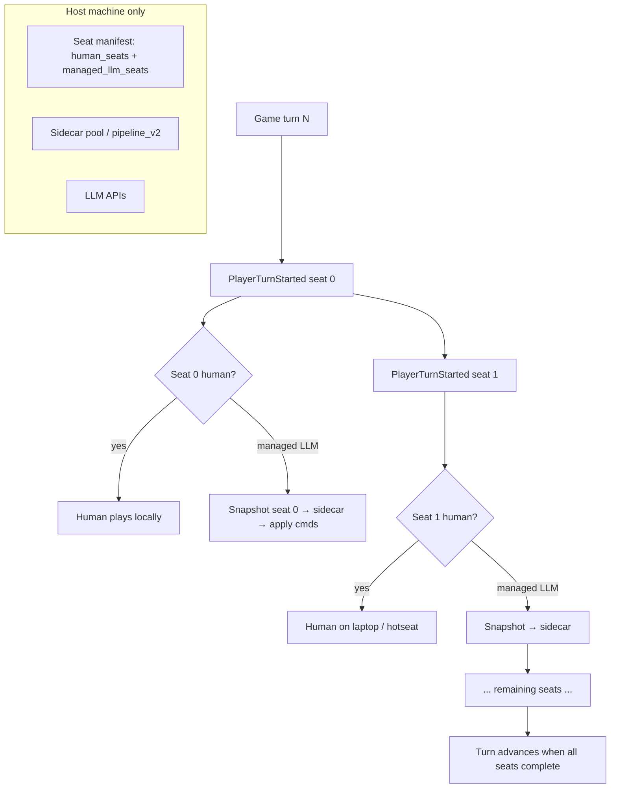

# Civ VI Research Spikes — Batch 01

**Date:** Aug 2026  
**Master doc:** [civ6-llm-ai-research.md §5](./civ6-llm-ai-research.md#5-deep-research--implementation-findings) (consolidated)  
**Parent:** [civ6-llm-ai-research.md](./civ6-llm-ai-research.md)  
**See also:** [civ6-map-coordinates.md](./civ6-map-coordinates.md) — grid vs hex, command `PARAM_X/Y`, indexing  
**Next batch:** [civ6-research-spikes-02.md](./civ6-research-spikes-02.md) — civStation, Real Strategy MP, modifiers vs Lua  
**Sources:** [civ6-mcp](https://github.com/lmwilki/civ6-mcp) Lua builders, Civ IV `Civ4AiTradeProposals.cpp`, CivFanatics / Sukritact modding KB

---

## Spike 1 — `legal_commands` Lua API inventory

### Design goal (match Civ IV)

Civ IV builds `legal_commands` in the DLL each turn: only **currently executable** instances, closed-world IDs, probed with native `can*` APIs. Civ VI has no public GameCore DLL; we replicate probing in **GameCore + InGame Lua** (same split [civ6-mcp](https://github.com/lmwilki/civ6-mcp) uses).

**Rule (from civ6-mcp):** `CanProduce` / `CanResearch` alone are **insufficient** — always pair with `CanStartOperation` / `CanStartCommand` where available ([`cities.py`](https://github.com/lmwilki/civ6-mcp/blob/main/src/civ_mcp/lua/cities.py)).

### Probe pattern

```lua
-- Snapshot for seat `me` (NOT always Game.GetLocalPlayer() in multi-seat mod)
local me = PLAYER_ID
local pCity = ... -- from city:GetID()
local bq = pCity:GetBuildQueue()
local te = Players[me]:GetTechs()
local cu = Players[me]:GetCulture()

-- Production: two-step gate
if bq:CanProduce(unit.Hash, true) then
  local check = { [CityOperationTypes.PARAM_UNIT_TYPE] = unit.Hash }
  if CityManager.CanStartOperation(pCity, CityOperationTypes.BUILD, check, true) then
    -- legal: queue_production UNIT ...
  end
end

-- Tech / civic
if te:CanResearch(tech.Index) and not te:HasTech(tech.Index) then
  -- legal: set_research TECH ...
end

-- Unit move (needs target coords in params)
local params = { [UnitOperationTypes.PARAM_X] = tx, [UnitOperationTypes.PARAM_Y] = ty }
if UnitManager.CanStartOperation(unit, UnitOperationTypes.MOVE_TO, nil, params) then
  -- legal: move_unit ...
end
```

References: [UnitManager.CanStartOperation](https://sukritact.github.io/Civilization-VI-Modding-Knowledge-Base/UnitManager.CanStartOperation), [WorldInput.lua](https://github.com/chaorace/Civ6-UIFiles/blob/master/WorldInput.lua) (Firaxis UI usage).

### API matrix by capability kind

| Civ6AI kind | Probe API(s) | Execute API | VM context | civ6-mcp reference |
|-------------|--------------|-------------|------------|-------------------|
| `set_research` (tech) | `te:CanResearch(idx)`, not `HasTech` | `UI.RequestPlayerOperation` + `PlayerOperations.RESEARCH`; GameCore fallback `SetResearchingTech` | InGame → GameCore | [`tech.py`](https://github.com/lmwilki/civ6-mcp/blob/main/src/civ_mcp/lua/tech.py) |
| `set_research` (civic) | culture prereqs + `cu:HasCivic` | `UI.RequestPlayerOperation` + `PROGRESS_CIVIC`; GameCore `SetProgressingCivic` | InGame → GameCore | `tech.py` |
| `queue_production` (unit/bldg) | `bq:CanProduce(hash,true)` **+** `CityManager.CanStartOperation(BUILD,…)` | `CityManager.RequestOperation` + `VALUE_REPLACE_AT` | InGame | `cities.py` |
| `queue_production` (district) | `CanProduce` + placement `PARAM_X/Y` | same | InGame | `cities.py` |
| `queue_production` (repair) | `CanStartOperation` on pillaged district/bldg | same | InGame | `cities.py` |
| `purchase_item` | `cityGold:GetPurchaseCost`, trader cap check | `CityManager` purchase ops | InGame | `cities.py` |
| `purchase_tile` | purchasable tile list / gold | `CityManager` | InGame | `map.py` |
| `set_city_focus` | city valid | `CityManager.SetCityFocus` | InGame | `economy.py` |
| `move_unit` | `UnitManager.CanStartOperation(MOVE_TO, params)` | `UnitManager.RequestOperation` | InGame | [`units.py`](https://github.com/lmwilki/civ6-mcp/blob/main/src/civ_mcp/lua/units.py) |
| `attack_target` | `RANGE_ATTACK` / `AIR_ATTACK` + LOS params | `RequestOperation` | InGame | `units.py` |
| `unit_posture` | `FORTIFY`, `ALERT`, heal op from `UnitAbilities` | `RequestOperation` | InGame | `units.py` |
| `worker_build` | `CanStartOperation(BUILD_IMPROVEMENT, params)` | `RequestOperation` | InGame | `units.py` |
| `found_city` | `CanStartOperation` on settler | `RequestOperation` | InGame | `units.py` |
| `promote_unit` | promotion list + `CanTrain`/`CanStart` | `UnitManager` | InGame | `units.py` |
| `upgrade_unit` | upgrade path | `UnitManager` | InGame | `units.py` |
| `delete_unit` | `UnitManager.CanStartCommand(DESTROY)` | `RequestCommand` | InGame | `units.py` |
| `propose_trade` | met, not at war, `DealManager` | `SendWorkingDeal(PROPOSED)` | InGame | [`diplomacy.py`](https://github.com/lmwilki/civ6-mcp/blob/main/src/civ_mcp/lua/diplomacy.py) |
| `respond_to_trade` | `GetWorkingDeal(INCOMING)` item count > 0 | `SendWorkingDeal(ACCEPTED/REJECTED)` | InGame | `diplomacy.py` |
| `declare_war` / peace | `pDiplo:IsAtWarWith`, session | `DiplomacyManager` + deals | InGame | `diplomacy.py` |
| `set_policies` / gov | slot validation | `Government` APIs | InGame | `governance.py` |
| `end_turn` | blockers via notifications | `UI.RequestPlayerOperation` ENDTURN | InGame | `end_turn.py` |

### Unit operations to enumerate per turn (tactical legal_commands)

From civ6-mcp + Firaxis `WorldInput.lua`, probe with `UnitManager.CanStartOperation(unit, op, nil, params)`:

| Operation | When |
|-----------|------|
| `MOVE_TO` | params: `PARAM_X`, `PARAM_Y`, optional `PARAM_MODIFIERS` |
| `SWAP_UNITS` | stack swap before move |
| `RANGE_ATTACK` | ranged / naval ranged |
| `AIR_ATTACK` / `DEPLOY` | air units |
| `COASTAL_RAID` | naval raiders |
| `WMD_STRIKE` | nukes |
| `REBASE` | air rebase |
| `BUILD_IMPROVEMENT` | builders |
| `BUILD_ROUTE` | builders |
| `FORTIFY` / `ALERT` | posture |
| `AUTOMATE_EXPLORE` etc. | from `UnitAbilities` operation table |
| Great person / religion ops | per `UnitOperationTypes` rows in DB |

**Discovery helper:** `UnitManager.GetOperationTargets(unit, opType)` — good for attack targets; civ6-mcp notes it can be empty for some valid naval targets; prefer `CanStartOperation` with explicit coords as authority.

### City / empire probes beyond production

| API | Use |
|-----|-----|
| `CityManager.CanStartCommand(city, CityCommandTypes.DESTROY, …)` | raze / keep / liberate gates |
| `Players[me]:GetTreasury():CanAfford(…)` | gold purchases |
| `pTrade:GetOutgoingRouteCapacity()` vs trader count | silent trader reject |
| `DealManager.GetPossibleDealItems` | trade inventory |
| `DiplomacyManager.FindOpenSessionID` | active diplomacy |

### Civ V `GameEvents.PlayerCan*` (do not assume in Civ VI)

Our repo’s `config/civ5-gameevents.json` is **Civ V Community Patch** ([source](https://github.com/LoneGazebo/Community-Patch-DLL)). Civ VI uses a smaller documented `GameEvents` set ([KB](https://sukritact.github.io/Civilization-VI-Modding-Knowledge-Base/GameEvents)). For Civ VI **prefer direct `Can*` methods** on `Player`, `City`, `BuildQueue`, `Techs`, `UnitManager`, `CityManager` rather than hooking `GameEvents.PlayerCanBuild`.

### Recommended `legal_commands` builder (implementation sketch)

1. **Per managed seat** `me`, not `Game.GetLocalPlayer()`.
2. **GameCore pass:** units list, cities, tech/civic lists (`te:CanResearch` loop), revealed map seed (`build_revealed_tiles_seed_query` in civ6-mcp `map.py`).
3. **InGame pass:** production options, unit `CanStartOperation` for idle units (cap N targets per unit for move/attack), pending deals, notifications/blockers.
4. Emit capped arrays (Civ IV uses max 512) with stable IDs: `CMD_PROD_CITY3_UNIT_ARCHER`, etc.
5. Validator in sidecar rejects any `cmd.N` not in snapshot (reuse `pipeline_v2.py`).

### Spike deliverable — next code step

- [ ] `config/civ6-command-probes.json` — machine-readable mirror of matrix above  
- [ ] FireTuner script: dump all `CanStartOperation` true ops for one test turn → fixture  
- [ ] Compare output count vs civ6-mcp tool calls on same save

---

## Spike 2 — Hex map / strategic view for LLM

### Does Civ VI have a built-in renderer we can use?

| Approach | Fog-aware? | LLM-ready? | Notes |
|----------|------------|------------|-------|
| **In-game “Strategic View”** (minimap toggle) | Yes (player view) | **No API export** | UI-only mode; [player discussion](https://steamcommunity.com/app/289070/discussions/0/4130430927304808747/) — not a data pipeline |
| **civ6-mcp `get_strategic_map`** | Partial | Text only | Ray-cast fog distance per city + unclaimed resources — **not a tile grid** ([`map.py`](https://github.com/lmwilki/civ6-mcp/blob/main/src/civ_mcp/lua/map.py)) |
| **civ6-mcp `get_map_area`** | Yes | Text | `vis:IsRevealed` / `IsVisible`; skips unrevealed tiles ([`map.py`](https://github.com/lmwilki/civ6-mcp/blob/main/src/civ_mcp/lua/map.py)) |
| **civ6-mcp `MapCapture` + web replay** | **No** (full map terrain) | PNG in **web dashboard** | [`map_capture.py`](https://github.com/lmwilki/civ6-mcp/blob/main/src/civ_mcp/map_capture.py) dumps **entire** `Map.GetGridSize()` for spectator replay — **not fog-filtered for LLM** |
| **Screenshot + VLM** | Yes | Possible | civ6-mcp AGENTS.md mentions VLM path; fragile, not deterministic |
| **Custom hex renderer (Civ IV `map_render.py` port)** | Yes | **Best for parity** | Reuse icon pipeline from `sidecar/map_icons/` |

### What civ6-mcp already built (reuse)

**Static terrain dump** (`build_static_map_dump`):

- Full grid: terrain, feature, hills, river, coastal, resource, owner, route per tile  
- One-time + per-turn ownership/road deltas → Convex web strategic map  
- Consumed by `convex_sync.py` + React replay UI ([commit](https://github.com/lmwilki/civ6-mcp/commit/ddb938ea3ee922d27bde75e5cca4d6ee03f45220))

**Fog-aware reads:**

```lua
local vis = PlayersVisibility[me]
if vis:IsRevealed(plotIdx) then ... end  -- get_map_area
if vis:IsVisible(plotIdx) then ... end   -- current vision + yields/units
```

**Bulk revealed set:** `build_revealed_tiles_seed_query()` — all revealed coords for spatial tracker.

### Recommended LLM minimap pipeline

```
GameCore/InGame Lua  →  JSON plot grid (only revealed tiles OR full grid + visibility mask)
        ↓
sidecar/map_render_civ6.py  →  hex layout (offset coords), terrain palette, territory tint
        ↓
PNG 512px + optional SVG  →  pipeline_v2 image attachment (same as Civ IV)
```

**Do not** use in-game Strategic View screenshot as primary path — no FireTuner hook to capture that framebuffer cleanly; civ6-mcp chose **data dump + external renderer** for the web app.

**Hybrid option:** Fork civ6-mcp web hex renderer (if open in `web/`) for PNG export; add `PlayersVisibility[me]:IsRevealed` mask so unrevealed tiles render as fog/blank.

### Spike deliverables

- [ ] Port `sidecar/map_render.py` to hex + GS terrain/feature enums  
- [ ] Lua exporter: cropped bbox around cities + units (mirror Civ IV `known_map`)  
- [ ] Compare PNG vs `get_map_area` text on one fixture save  

---

## Spike 3 — Multi-seat controller (turn flow + multi-LLM + multi-human)

### Civ VI turn event order (single player / sequential)

Community testing ([CivFanatics Lua Objects](https://forums.civfanatics.com/threads/lua-objects.601146/page-11)) documents per-player ordering:

```
GameEvents.PlayerTurnStarted(playerID)
GameEvents.PlayerTurnStartComplete(playerID)
    ← move points restored; LLM hook window (see Spike 5)
    ← native AI unit phase runs here (engine-internal)
Events.PlayerTurnActivated(playerID)
    ← UI / human interaction window
Events.PlayerTurnDeactivated(playerID)
```

Also: `GameEvents.PlayerTurnStarted` fires for **every alive major** ([Gedemon HSD](https://github.com/Gedemon/Civ6-Historical-Spawn-Dates/blob/master/Scripts/ScriptHSD.lua), [Modiki GameEvents](https://modiki.civfanatics.com/index.php?title=Lua_Game_Events)).

**Human-only UI events:** `Events.LocalPlayerTurnBegin`, `Events.ActivePlayerTurnStart` — not fired for AI seats.

### Game turn vs player turn

| Concept | Event / API |
|---------|-------------|
| Global turn counter | `Game.GetCurrentGameTurn()` |
| Each player's slice | `GameEvents.PlayerTurnStarted` per `playerID` |
| Simultaneous MP | `GameConfiguration.IsNetworkMultiplayer()` + dynamic turns — humans overlap until all ready ([GCO mod note](https://github.com/Gedemon/Civ6-GCO/blob/master/Scripts/GCO_PlayerScript.lua)) |

### Multi-human + multi-LLM seat model (mirror Civ IV)



**Seat manifest (env / config):**

| Variable | Example | Role |
|----------|---------|------|
| `CIV6AI_HUMAN_SEATS` | `0,2` | Never call LLM |
| `CIV6AI_MANAGED_SEATS` | `1,3,4,5` | LLM strategic pulse each player-turn |
| Host flag | implicit on MP host | Only host runs sidecar (Civ IV model) |

### Parallel LLM fan-out (reuse Civ IV)

`CvAiHostBridge.py` pattern:

- On **first** managed `PlayerTurnStarted` of game turn N, prefetch snapshots for **all** managed seats (async sidecars).  
- When seat `k` activates, await prefetched result or spawn sequential fallback.  
- Rate limit: `CIV6AI_PARALLEL_MAX`, stagger seconds between spawns.

**Civ VI caveat:** prefetch snapshot for seat 3 before seat 3’s turn is **valid** for empire/city/research state; unit positions may shift when earlier seats act in same game turn (same class of issue documented in Civ IV bridge comments).

### civ6-mcp blocker: `Game.GetLocalPlayer()`

Today civ6-mcp hardcodes `local me = Game.GetLocalPlayer()` in most builders. For multi-LLM:

- Parameterize `me` in all Lua templates (`Players[me]:…`).  
- **InGame UI ops** (`UI.RequestPlayerOperation`, some `UnitManager` paths) may only work for **local** player ([forum](https://forums.civfanatics.com/threads/lua-using-ui-commands-for-ai-players.633148/)).  
- **Workarounds:**  
  1. **GameCore** methods with explicit player ID (`SetResearchingTech`, `CityManager` on AI cities) — civ6-mcp already uses these as fallbacks.  
  2. Temporary `PlayerManager.SetLocalPlayerAndObserver(aiSeat)` on host (visual flicker; MP risky).  
  3. **Autoplay / observer** host runs all AI majors while humans occupy subset of seats.

### MP-specific (research only — FireTuner disabled)

- FireTuner **does not work in MP** ([thread](https://forums.civfanatics.com/threads/fire-tuner-in-multiplayer-not-connecting.643763/)).  
- Multi-seat LLM in MP requires **in-game Lua mod** on host; sidecar on host only.  
- GCO notes: in network MP, AI unit updates may run **after** all humans finish ([GCO_PlayerScript.lua](https://github.com/Gedemon/Civ6-GCO/blob/master/Scripts/GCO_PlayerScript.lua)) — validate hook timing on LAN soak.

### Spike deliverables

- [ ] SP test: 6 majors, 1 human + 5 LLM via seat parameterization (no MP)  
- [ ] Event logger mod: confirm ordering on your GS build  
- [ ] Document which commands need GameCore vs local-player UI path per seat  

---

## Spike 4 — Trade async (Civ VI vs Civ IV mod)

### Civ IV mod flow (reference)

From `Civ4AiTradeProposals.cpp`:

1. **Propose:** `Civ4AiTrade_queueProposal(recipient, sender, lists)` → adds `CvDiploParameters` to **recipient’s** queue — no immediate resolution.  
2. **Snapshot:** `diplomacy.pending_requests` with stable `accept_cmd` / `reject_cmd` / `counteroffer_cmd`.  
3. **Respond:** recipient turn → `resolveProposal` or `counterProposal` (re-queues to other player).  
4. **DM/chat:** optional trade DM lines when `tradeDmEnabled()`.

### Civ VI native flow (`DealManager` + `DiplomacyManager`)

From civ6-mcp [`diplomacy.py`](https://github.com/lmwilki/civ6-mcp/blob/main/src/civ_mcp/lua/diplomacy.py) and Firaxis [`DiplomacyActionView.lua`](https://github.com/chaorace/Civ6-UIFiles/blob/master/DiplomacyActionView.lua):

```mermaid
sequenceDiagram
  participant A as Proposer (seat A)
  participant DM as DealManager
  participant B as Target (seat B)

  A->>DM: ClearWorkingDeal(OUTGOING) unless HasPendingDeal
  A->>DM: GetWorkingDeal(OUTGOING) + AddItems
  A->>DM: SendWorkingDeal(PROPOSED)
  Note over DM,B: Network sync in MP
  B->>DM: INCOMING working deal populated
  alt AI target (civ6-mcp propose path)
    A->>DM: Read INCOMING; if items, SendWorkingDeal(ACCEPTED)
  else LLM target responds later
    B->>DM: respond_to_trade ACCEPTED/REJECTED
  end
```

| Step | Civ IV mod | Civ VI (civ6-mcp) |
|------|------------|-------------------|
| Build offer | Wire `propose_deal` → DLL queue | `GetWorkingDeal(OUTGOING)` + item Lua |
| Preview fairness | — | `SendWorkingDeal(EQUALIZE)` → read INCOMING (`mode=test`) |
| Send | Queue to recipient diplomacy | `SendWorkingDeal(PROPOSED)` |
| Pending detection | DLL `pending_requests` | `get_pending_trades`: scan `GetWorkingDeal(INCOMING)` per met player |
| Accept/reject | `respond_to_deal` synced | `SendWorkingDeal(ACCEPTED/REJECTED)` |
| Counteroffer | `counteroffer` re-queue | New PROPOSED with adjusted items (no separate counter ID) |
| Block duplicate | `HasPendingDeal` guard | Same — `if not HasPendingDeal then ClearWorkingDeal` |
| Async across turns | **Yes** — queue until recipient turn | **Partial** — INCOMING deal persists; civ6-mcp **auto-accepts AI** in same Lua tick |

### Mapping to Civ4AI wire format

| Wire field | Civ VI source |
|------------|---------------|
| `diplomacy.pending.N` | `build_pending_deals_query` → `DEAL|playerId|…` + `ITEM|…` |
| `propose_trade` cmd | `build_propose_trade` (skip auto-accept for LLM targets) |
| `respond_to_trade` cmd | `build_respond_to_deal` |
| `mode=test` | `build_test_trade` (EQUALIZE, no commit) |
| Trade DM / chat | **Gap** — use `DiplomacyManager` statements or custom chat mod |

### Implementation notes for LLM↔LLM async

1. **Disable auto-accept** in propose path when target seat is `CIV6AI_MANAGED_SEATS`.  
2. On target’s `PlayerTurnStarted`, snapshot includes INCOMING deals → `respond_to_trade` in `legal_commands`.  
3. **Counteroffer:** treat as new `propose_trade` from responder with `mode=test` first.  
4. **MP:** `DealManager.SendWorkingDeal` must run on network-safe path (InGame on host); identical mod versions required ([MP mod thread](https://forums.civfanatics.com/threads/civ-6-cant-get-my-mods-to-work-in-mp-always-desyncing-or-getting-stuck-to-please-wait-on-bottom.640390/)).

### Spike deliverables

- [ ] SP test: A proposes on turn T, B responds on turn T+k (two LLM seats)  
- [ ] Log `HasPendingDeal` / session IDs across turns  
- [ ] Document whether OUTGOING proposals persist for proposer UI when target is AI  

---

## Spike 5 — Deterministic fallback (native AI moves unmoved units)

### Civ IV model

- LLM pulse: research, production, diplomacy, **no** `move_group` / `attack_target`.  
- After pulse: **AdvCiv / native AI** runs tactical movement for managed seat.  
- Documented in `CvAiHostBridge.py`: prefetch snapshots may be sparse on units; native AI still runs unit logic.

### Civ VI engine behavior

Native **Firaxis AI** moves units for AI majors during the turn slice **between** `PlayerTurnStartComplete` and `PlayerTurnActivated` (forum timing). Humans use UI in `PlayerTurnActivated`.

**Do not** zero out all unit moves to “block AI” — breaks fallback and causes MP desync risk. Blocking AI by `ChangeMovesRemaining` was a Civ V MP hack with side effects ([thread](https://forums.civfanatics.com/threads/how-to-stop-ai-to-move-units.480497/)).

### Recommended Civ VI split (deterministic)

| Phase | Hook | Action |
|-------|------|--------|
| 1 | `PlayerTurnStarted` | Build snapshot; start sidecar async |
| 2 | `PlayerTurnStartComplete` | **Await sidecar**; apply LLM **non-tactical** cmds + optional explicit unit ops |
| 3 | Engine AI window | Units with **remaining moves** → native AI |
| 4 | `PlayerTurnActivated` | Human UI only |

**Why this works:** LLM `RequestOperation(MOVE_TO)` consumes moves on commanded units; untouched units retain `GetMovesRemaining() > 0` → native AI still acts.

### Policies to preserve fallback

| Policy | Rationale |
|--------|-----------|
| **Do not** call `skip_remaining_units` / `fortify_remaining` unless ending human-style cleanup | Would mark units done before AI phase |
| **Do not** blanket `ChangeMovesRemaining(-all)` | Civ V/Civ VI anti-AI hack |
| Optional: LLM tactical mode off by default | Match Civ IV — only `set_research`, `queue_production`, diplomacy |
| If LLM does move a unit, that unit is **intentionally** excluded from AI (moves spent) | Deterministic |

### If LLM tactical mode ON

- Track `llm_touched_unit_ids` this turn in mod Lua.  
- **Not recommended:** try to “restore AI” on touched units — no clean `PlayerPreAIUnitUpdate` in Civ VI ([Civ5-only event](https://modiki.civfanatics.com/index.php/GameEvents.PlayerPreAIUnitUpdate_(Civ5_API))).  
- Accept split: LLM-moved units stay as commanded; others get native AI.

### Advanced (future): strategy hooks

Civ V DLL exposed `MilitaryStrategyCanActivate` / `EconomicStrategyCanActivate` ([bc1 list](https://forums.civfanatics.com/threads/gameevents-and-the-dll-source.515978/)). Civ VI analog unclear — would need Community Extension or scripted `GetAi_Military():StartScriptedOperation…` ([GCO](https://github.com/Gedemon/Civ6-GCO/blob/master/Scripts/GCO_AIUnitScript.lua)) for custom ops — **not** deterministic vanilla fallback.

### Spike deliverables

- [ ] Event logger: confirm AI moves unit X only when LLM did not move X on same turn  
- [ ] Test save: managed seat, LLM sets production only → verify units still move  
- [ ] Test: LLM moves scout only → verify other units still move, scout does not  

---

## Cross-spike dependencies

```
legal_commands inventory ──→ multi-seat controller (per-seat probes)
        │                           │
        └───────────┬───────────────┘
                    ↓
            map renderer (revealed grid from probe pass)
                    │
            trade async (pending in snapshot legal_commands)
                    │
            fallback timing (apply cmds before AI phase)
```

---

## Open gaps (future spikes)

| ID | Topic |
|----|-------|
| G1 | FireTuner spike: parameterize `me` for seat 3 on hotseat save |
| G2 | MP LAN: `PlayerTurnStartComplete` vs GCO network ordering |
| G3 | `config/civ6-command-probes.json` codegen from civ6-mcp Lua |
| G4 | Fork civ6-mcp web hex renderer + fog mask for PNG export |
| G5 | Community Extension: AI suppression hooks audit |
| G6 | Diplomacy chat overlay for trade DM parity with Civ IV |

---

*Update this file as spikes complete; link PRs and fixture paths inline.*
