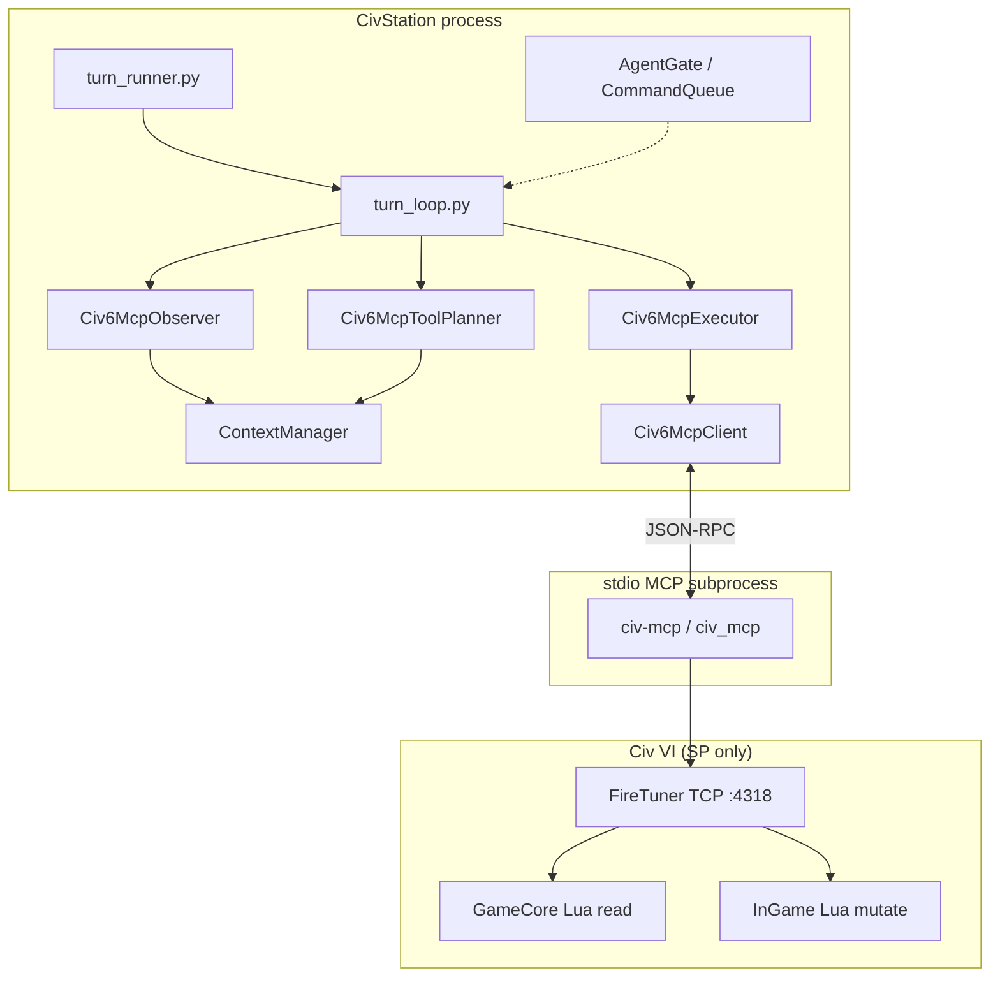

# Civ VI Research Spikes — Batch 02

**Date:** Aug 2026  
**Master doc:** [civ6-llm-ai-research.md §5](./civ6-llm-ai-research.md#5-deep-research--implementation-findings) (consolidated)  
**Parent:** [civ6-llm-ai-research.md](./civ6-llm-ai-research.md)  
**Prior batch:** [civ6-research-spikes-01.md](./civ6-research-spikes-01.md)  
**Topics:** civStation (civ6-mcp wrapper), Real Strategy MP desync, Civ VI modding (modifiers vs Lua)

---

## Spike 6 — civStation wrapper around civ6-mcp

### What it is

[civStation](https://github.com/NomaDamas/civStation) is a **full-stack Civ VI agent** (observe → plan → act → human-in-the-loop) originally built around **screenshots + VLM + pyautogui**. The NomaDamas fork adds a second, **mutually exclusive** backend that drives the game through upstream [lmwilki/civ6-mcp](https://github.com/lmwilki/civ6-mcp) instead of pixels.

Canonical upstream README points to [minsing-jin/civStation](https://github.com/minsing-jin/civStation); the **civ6-mcp backend** lives on the NomaDamas fork today (`civStation/agent/modules/backend/civ6_mcp/`).

**Do not confuse two different “MCP” products:**

| Surface | Command / entry | What it is |
|---------|-----------------|------------|
| **civ6-mcp action backend** | `civstation run --backend civ6-mcp` | Spawns **upstream** `civ-mcp` stdio server; planner emits tool calls (`set_research`, `unit_action`, `end_turn`, …) |
| **CivStation layered MCP** | `civstation mcp` | CivStation’s **own** MCP server (context / strategy / action / HITL / session tools) — extension layer, not the FireTuner bridge |

For Civ4AI Phase A, civStation is a **reference implementation** for subprocess MCP + turn loop — not the target architecture (we want `pipeline_v2.py` + in-game mod, mirroring Civ IV).

### Architecture (civ6-mcp backend)



**Startup (validated before any VLM stack loads):**

- `--backend civ6-mcp` (default is `vlm`)
- `--civ6-mcp-path` or `CIV6_MCP_PATH` → directory with `pyproject.toml`
- `--civ6-mcp-launcher uv|python` → `uv run --directory <path> civ-mcp` or `python -m civ_mcp`
- `turn_runner._guard_backend_runtime_state()` **hard-fails** if VLM components (screenshot router, pyautogui) coexist with civ6-mcp client

**Client lifecycle** (`client.py`):

- Dedicated asyncio thread + `mcp.client.stdio.stdio_client`
- Handshake catalogs tools; health check against required tools (`get_game_overview`, `end_turn`, …)
- Synchronous `call_tool` facade for the turn loop

### Turn loop vs Civ4AI

| Stage | civStation civ6-mcp | Civ4AI (`CvAiHostBridge` + `pipeline_v2`) |
|-------|---------------------|---------------------------------------------|
| Trigger | External agent loop (`run_civ6_mcp_turn_loop`) | In-game `PlayerTurnStarted` / bridge hook |
| Observation | Many `get_*` MCP tools → `StateBundle` → `ContextManager` | Single fog-filtered JSON snapshot from DLL |
| Plan format | JSON `tool_calls[]` (MCP tool names + args) | Flat wire: `thought.*`, `cmd.N`, `chat.*` |
| Validation | civ6-mcp tool semantics + `end_turn` reflection fields | JSON schema + `command-capabilities-v2.json` |
| Execution | `Civ6McpOperationDispatcher` → MCP | `sendAiCommand` / InGame Lua apply |
| Memory | ContextManager + strategy updater; **no** per-leader opinion/history wire | `Civ4AiThoughtMemory`, opinions, histories |
| HITL | Dashboard `:8765`, WebSocket, [civ6_tacticall](https://github.com/minsing-jin/civ6_tacticall) mobile | Chat overlay / autotest (Civ IV) |
| MP | **Not supported** (FireTuner) | Host-authoritative MP path exists |

**Planner contract** (`planner.py`):

- Allowlisted tools only (`DEFAULT_PLANNER_TOOL_ALLOWLIST`)
- Final tool call **must** be `end_turn` with non-empty reflection strings (`END_TURN_REFLECTION_FIELDS`)
- If planner omits `end_turn`, turn loop can **synthesize** a defensive `end_turn` (`synthesize_end_turn_on_missing`)
- `build_prioritized_turn_plan()` injects `PRIORITIZED_MCP_INTENTS` into planner context (heuristic ordering before raw tool dump)

**Observer** (`observer.py`):

- Iterates discovered `get_*` tools (30s deadline budget)
- Parses text responses into `Civ6McpNormalizedObservation`
- Mirrors compact fields into `ContextManager` for shared strategy/router code paths

### VLM backend (default) — why civ6-mcp is separate

| Aspect | `vlm` | `civ6-mcp` |
|--------|-----|------------|
| Observation | Screenshots + VLM extraction | Native `get_*` tools |
| Action | 14 UI primitives via pyautogui | ~76 MCP tools |
| Game window | Must be visible, layout-sensitive | Irrelevant |
| Achievements | Can work with normal UI | Requires GS, achievements off, FireTuner |
| Failure modes | Mis-clicks, OCR drift | Tool text errors, FireTuner disconnect |

CivStation explicitly **does not** fall back from VLM to civ6-mcp mid-run — backends are exclusive to avoid racey dual control.

### Reuse recommendations for Civ4AI

**Worth copying:**

1. **Subprocess MCP client pattern** — threaded asyncio stdio, startup validation, tool catalog health check → direct template for `civ6_adapter.py` wrapping civ6-mcp without Claude Desktop.
2. **Text error classification** — `classify_civ6_mcp_text()` / terminal outcomes (`game_over`, `hang`) for sidecar circuit breaker.
3. **Mandatory turn close** — civ6-mcp requires `end_turn`; Civ4AI uses implicit “no more cmds”; adapter should map `pipeline_v2` “turn complete” to `end_turn` or mod-level “pulse complete” event.
4. **HITL session model** — optional for debugging LLM seats before full autotest.

**Do not copy as primary path:**

1. **ContextManager + CivStation planner** — replace with `pipeline_v2.py` prompt, personality fixtures, thought memory.
2. **civstation mcp layered server** — unless we want external IDE control of the same sidecar; Civ IV already has a tighter in-mod bridge.
3. **Full unit micro planner allowlist** — product decision: Civ IV defaults to strategy-only + native tactics.

**Minimal Phase A spike (from this research):**

```text
civ6_adapter.py:
  Civ6McpClient.start()
  snapshot = call get_game_overview + targeted get_*  (or one mod export later)
  decision = pipeline_v2.run(snapshot, personality)
  map decision cmds → MCP tool calls
  executor.execute_many(...); force end_turn
```

### civStation gaps relative to Civ4AI goals

- Single `Game.GetLocalPlayer()` seat (same as raw civ6-mcp)
- No fog-filtered map PNG for LLM vision
- No async trade inbox / LLM↔LLM diplomacy parity
- No per-leader `opinion.*` / `history.*` wire
- No MP / no multi-seat stagger (`CIV4AI_MANAGED_SEATS`)

### References

- [NomaDamas/civStation README — Backend Selection](https://github.com/NomaDamas/civStation#backend-selection)
- [civStation `turn_loop.py`](https://github.com/NomaDamas/civStation/blob/master/civStation/agent/modules/backend/civ6_mcp/turn_loop.py)
- [civStation `client.py`](https://github.com/NomaDamas/civStation/blob/master/civStation/agent/modules/backend/civ6_mcp/client.py)
- [Layered MCP docs](https://github.com/NomaDamas/civStation/blob/master/docs/layered_mcp.md)

---

## Spike 7 — Civ VI Real Strategy MP desync

### Report ([issue #26](https://github.com/Infixo/Civ6-Real-Strategy/issues/26))

| Field | Detail |
|-------|--------|
| Reporter | 2-player MP, new game, ~turn 100 |
| Symptom | Desync **every turn** during **end turn** after installing Real Strategy on both clients |
| Reconnect / restart | Did not fix |
| Mod delta | Only change vs prior stable MP sessions |
| Developer (@Infixo) | Suspects **calling UI context from GameCore** |
| Status | **Open** (no confirmed root-cause fix in repo) |

**Community noise (not authoritative):**

- Workshop thread: some MP groups run RST successfully; others blame mod combos (YNAMP, worker automation Lua, custom civs).
- Steam (2019): one player’s desync **was not RST** after further debugging; developer noted correlation ≠ causation.

Treat RST MP as **“works for many, fragile for some”** until we have a repro save.

### What Real Strategy is (relevant to native-AI fallback)

[Infixo/Civ6-Real-Strategy](https://github.com/Infixo/Civ6-Real-Strategy) replaces Firaxis AI **strategy selection** with data-driven priorities:

| Layer | Files | Role |
|-------|-------|------|
| SQL data | `base/RealStrategy_Main.sql`, `RealStrategy_Leaders.sql`, `RealStrategy_Tactics.sql`, … | Modifiers, AiLists, flavor tables, operation hooks |
| GameCore Lua | `Lua/RealStrategy.lua` (~120k lines) | Per-turn strategy scoring, persistence, event handlers |
| InGame bridge | `Lua/RealStrategy_InGameExp.lua` | Registers `ExposedMembers.RST.*` wrappers for UI-only APIs |
| Great People | `RealStrategy_GreatPeople.lua` | GP-specific logic |

Workshop marketing claims **MP support**; implementation includes an explicit `MULTIPLAYER SUPPORT` section in GameCore Lua.

### MP randomness — critical default

From `base/RealStrategy_Params.sql`:

```sql
INSERT INTO GlobalParameters (Name, Value) VALUES ('RST_OPTION_RANDOM', '2');
-- 0 = OFF | 1 = ON (math.random) SP-only | 2 = ON (Game.GetRandNum) MP-safe
```

`RealStrategy.lua` implements:

```lua
function GetRandomNumber(iMin, iMax)
  if eOptionRand == 0 then return 0 end
  if eOptionRand == 1 then return math.random(iMin, iMax) end
  return Game.GetRandNum(iMax - iMin + 1, "Real Strategy Roll") + iMin
end
```

**Implication:** MP desync from **RNG divergence** is unlikely *if* default `2` is active on all clients. Desync from **`math.random`** or **`pairs()` iteration order** in custom forks/settings remains possible.

### GameCore ↔ InGame bridge (desync hypothesis)

Civ VI runs **separate Lua VMs**:

| Context | Typical APIs | Network role |
|---------|--------------|----------------|
| **GameCore** | `Players[]`, `Game.*`, `Map.*`, `GameInfo.*` | Simulation / sync path |
| **InGame** | `UnitManager.*`, `CityManager.*`, `UI.*`, `Cities.GetCityInPlot` | Client UI + command issuance |

**Firaxis / community rule:** mutate game state through **network-synchronized operations** from the correct context; do not assume GameCore can call UI managers safely in MP.

Real Strategy’s pattern:

1. `RealStrategy_InGameExp.lua` (InGame) exposes functions on `ExposedMembers.RST` — e.g. `PlayerGetCultureVictoryProgress`, `GreatPersonActivate` (uses `UnitManager.RequestCommand`), `PlayerManager.GetAliveMajorIDs`, etc.
2. `RealStrategy.lua` (GameCore) reads `local RST = ExposedMembers.RST` and calls `RST.PlayerGetMilitaryStrength(ePlayerID)`, `RST.PlayerGetSlottedPolicies`, … during AI strategy evaluation.

This is a **deliberate cross-context bridge** Firaxis uses elsewhere, but it is fragile:

- If InGame handlers are unavailable or return different values per client, GameCore AI decisions diverge → checksum desync at turn boundary.
- Developer comment on issue #26 aligns with **GameCore calling into UI-layer code paths** (whether via `ExposedMembers` or direct `UnitManager`).

**Commented-out hazard** in GameCore (currently disabled):

```lua
-- MoveUnit from Gameplay context
-- function MoveUnitToPlot(...)
--   local pUnit = UnitManager.GetUnit(ePlayerID, iUnitID);
--   UnitManager.MoveUnit(pUnit, iX, iY);
-- end
```

Active InGame code **does** call `UnitManager` for GP activation — from InGameExp, not GameCore.

### Why “end turn” desync timing matters

Turn end is when:

- AI seats finish unit operations and strategy re-evaluation runs
- Persistent mod data is saved (`SaveDataToGameSlot` / `GameConfiguration` in RST)
- Victory/strategy priorities recomputed using bridged `RST.*` helpers

A **one-unit move mismatch** or **one integer flavor roll** at turn 100 can surface as “desync on end turn” even if the bug is earlier in the turn.

### Comparison to Civ4AI fallback options (Phase C)

| Option | MP risk | Notes |
|--------|---------|-------|
| Firaxis AI only (LLM sets production/research) | Lower | Same as “pulse before native AI” in spikes-01 |
| Real Strategy for non-LLM seats | Medium | Proven SP value; MP needs soak + version lock |
| Real Strategy on LLM seats | **High** | Double AI authority: LLM pulse + RST strategy rewrite |
| Community Extension custom ops | Unknown | Needs audit; no public GameCore DLL for Civ VI |

**Recommended policy for Civ4AI:**

1. **SP:** Real Strategy acceptable for **non-managed** AI majors while debugging LLM seat.
2. **MP:** Do **not** bundle RST in v1; if used, **pin exact Workshop version** on all clients and keep RST off LLM-managed seats.
3. **Our mod:** Never call `UnitManager` / `CityManager` / `UI.*` from GameCore — snapshot in GameCore, apply commands in InGame (civ6-mcp pattern).

### Repro checklist (future spike G7)

- [ ] 2-player MP, GS, **only** Real Strategy, default `RST_OPTION_RANDOM=2`
- [ ] Same mod hash on both clients; no YNAMP / worker AI / custom civs
- [ ] Log turn of first desync; capture both `Logs/` folders
- [ ] Control: identical lobby **without** RST to turn 120+
- [ ] If desync: try `RST_OPTION_RANDOM=0` (deterministic priorities) — isolates RNG vs bridge

### References

- [GitHub issue #26](https://github.com/Infixo/Civ6-Real-Strategy/issues/26)
- [RealStrategy_Params.sql](https://github.com/Infixo/Civ6-Real-Strategy/blob/main/base/RealStrategy_Params.sql)
- [RealStrategy.lua (GameCore)](https://github.com/Infixo/Civ6-Real-Strategy/blob/main/Lua/RealStrategy.lua)
- [RealStrategy_InGameExp.lua](https://github.com/Infixo/Civ6-Real-Strategy/blob/main/Lua/RealStrategy_InGameExp.lua)
- [MP mod desync thread](https://forums.civfanatics.com/threads/civ-6-cant-get-my-mods-to-work-in-mp-always-desyncing-or-getting-stuck-to-please-wait-on-bottom.640390/)

---

## Spike 8 — Civ VI modding overview (modifiers vs Lua)

### Executive summary

| Approach | Best for | MP stability | Civ4AI usage |
|----------|----------|--------------|--------------|
| **Modifiers (XML/SQL)** | Stats, yields, combat, costs, requirements, passive traits | **High** when all clients share identical data | Personality as data (flavors), not runtime Lua |
| **GameCore Lua** | AI hooks, events, read-mostly snapshot builders, persistence | **Medium** — must avoid UI APIs and local RNG | Turn hooks, snapshot export, legal-command probes |
| **InGame Lua** | `UnitManager`/`CityManager` commands, UI overlays | **Medium** — mutations must use synced ops | Apply LLM command list |
| **UI context Lua** | Overlays, chat panels, human-only tooling | **Low in MP** for gameplay logic | Optional chat overlay (SP first) |
| **Community Extension DLL** | Hooks not exposed in vanilla Lua | Unknown — test per build | Future: AI suppression audit |

**No public Civ VI GameCore DLL** (unlike Civ IV CP / Civ V Vox Populi). Deep engine changes require [Wild-W/CivilizationVI_CommunityExtension](https://github.com/Wild-W/CivilizationVI_CommunityExtension) or similar — higher MP test burden.

### Modifiers system

Modifiers are **data-driven effect graphs** loaded from XML/SQL:

- **Modifier** — applies an **Effect** (e.g. `EFFECT_ADJUST_CITY_YIELD_CHANGE`) with **Arguments**
- **Collection** — scope (player, city, district, unit, plot, …)
- **Requirement** — conditions (has tech, district count, difficulty, …)

Loaded into GameCore; evaluated **deterministically** on all peers when mod data matches.

**Community consensus** ([MP mod thread](https://forums.civfanatics.com/threads/civ-6-cant-get-my-mods-to-work-in-mp-always-desyncing-or-getting-stuck-to-please-wait-on-bottom.640390/)):

> Mods based only on the modifier system … are safe as the game core handle the new attributes in the exact same way on all computers of a network game (as long as everyone have the same version of the mod).

**Guides:**

- [Using Modifiers Ch.1 — creating and attaching](https://forums.civfanatics.com/threads/using-modifiers-chapter-1-creating-and-attaching-modifiers.605835/)
- [Ch.2 — dynamic modifiers, effects, collections, arguments](https://forums.civfanatics.com/threads/chapter-2-dynamic-modifiers-effects-collections-and-arguments.608917/)

**Civ4AI:** use modifiers for **static** leader/civ tuning if we ship Workshop content; keep **LLM personality** in sidecar JSON (fixtures), not SQL, to avoid Workshop update churn.

### Lua contexts (practical rules)

Documented split (also [civ6-mcp `run_lua`](https://glama.ai/mcp/servers/lmwilki/civ6-mcp/tools/run_lua)):

| Context | Safe reads | Mutations |
|---------|------------|-----------|
| `gamecore` | `Players[]`, `Game.*`, `Map.*`, `GameInfo.*` | **Avoid** — not the InGame command path |
| `ingame` | Above + plot/city helpers | `UnitManager.RequestOperation`, `CityManager.CanStartOperation`, diplomacy UI flows |

**MP desync sources (Lua):**

1. `math.random()` without synced seed (`Game.GetRandNum` with stable tag string is the usual MP pattern — see RST)
2. GameCore calling **InGame-only** APIs (`UnitManager`, `CityManager`, `UI`)
3. Lua changing state on **non-host** without net message ([Civ5 analogue thread](https://forums.civfanatics.com/threads/non-host-player-calling-initunit-and-kill-lua-functions-causing-re-sync-in-multiplayer-game.678526/))
4. `pairs()` over tables with **non-deterministic order** affecting synced decisions
5. Client-only UI state leaking into AI logic (local player assumptions — civ6-mcp’s `Game.GetLocalPlayer()` problem)

**“Please wait” stuck state** (MP thread): often **desync or mod Lua deadlock** at turn handoff — same class of bugs as checksum failure, different symptom.

### How Firaxis AI vs script AI fits

| System | Mechanism | MP |
|--------|-----------|-----|
| Vanilla Firaxis AI | Native DLL + AiOperations + AiLists in data | Baseline |
| Real Strategy | SQL AiLists + GameCore Lua strategy scoring + InGame bridge | Claimed; reported edge cases |
| Gedemon GCO-style | `GetAi_Military():StartScriptedOperation` in GameCore | Used in SP scenarios; MP untested for Civ4AI |
| LLM (our target) | External decision + InGame apply at `PlayerTurnStartComplete` | Requires host-authoritative command list |

### Civ4AI mod shape (recommended)

```text
Civ6Ai.modinfo
├── SQL/                     # optional balance — modifiers only
├── Gameplay/
│   └── Civ6Ai_GameCore.lua  # Events, snapshot JSON export, legal_commands probe
├── InGame/
│   └── Civ6Ai_InGame.lua    # Apply validated commands; ExposedMembers if needed
└── UI/                      # optional SP chat overlay
    └── Civ6Ai_Chat.lua
```

**Rules:**

1. **Snapshot** — GameCore only; no fog leaks unless explicitly intended; seat id parameterized (`me`, not `GetLocalPlayer()` for AI seats).
2. **Apply** — InGame only; one batch per pulse at `PlayerTurnStartComplete` (see spikes-01 §3).
3. **Bridge** — If GameCore needs UI-only data, expose **read-only** InGame functions via `ExposedMembers` like RST; never move units from GameCore.
4. **RNG** — No `math.random` in MP paths; use `Game.GetRandNum` with fixed reason strings or no RNG.
5. **FireTuner** — SP dev only; production path is file bridge + sidecar (Phase B).

### Feature placement matrix (Civ IV → Civ VI)

| Civ4AI feature | Modifier? | GameCore Lua | InGame Lua | Sidecar |
|----------------|------------|--------------|------------|---------|
| Legal commands / probes | — | ✓ build list | ✓ confirm `CanStart*` | schema validate |
| Fog snapshot | — | ✓ `IsRevealed` | — | map_render |
| Thought / opinion / history | — | — | — | ✓ pipeline_v2 |
| Trade async inbox | — | ✓ detect deals | ✓ `DealManager` | queue like Civ IV |
| Chat | — | — | UI optional | ✓ `chat.*` wire |
| Native tactics fallback | — | ✓ timing hook | — | policy flag |
| Personality flavors | optional SQL | — | — | ✓ fixtures |

### References

- [Modding feature thread (journalists / community)](https://forums.civfanatics.com/threads/writing-feature-about-civ-6-modding-want-to-chat.655219/) — overview interviews; blocked behind forum bot for automated fetch
- [MP mod desync thread](https://forums.civfanatics.com/threads/civ-6-cant-get-my-mods-to-work-in-mp-always-desyncing-or-getting-stuck-to-please-wait-on-bottom.640390/)
- [Sukritact / community modding KB](https://github.com/Sukritact/Modding-Knowledge-Base) — patterns (verify per-expansion)
- [Community Extension](https://github.com/Wild-W/CivilizationVI_CommunityExtension)
- [civ6-mcp context split](https://civ6-mcp.lwilko.com/docs)

---

## Cross-spike implications (batch 02 → implementation)

```text
civStation client/executor pattern  →  Phase A civ6_adapter.py (subprocess MCP)
Real Strategy MP lessons           →  Phase C: cautious fallback; no GameCore UI
Modifiers vs Lua rules              →  Phase B mod skeleton + MP discipline
```

| Decision | Recommendation after batch 02 |
|----------|-------------------------------|
| Wrap civ6-mcp | Yes — civStation `Civ6McpClient` is the reference; wire to `pipeline_v2` not CivStation planner |
| Ship Real Strategy in MP package | **No** for v1 |
| Use modifiers in Civ6Ai mod | Optional static tuning only |
| GameCore `ExposedMembers` bridge | Only if needed for read-only probes; minimize |

---

## Open gaps (carried forward)

| ID | Topic | Priority |
|----|-------|----------|
| G7 | MP soak: RST on/off, turn 120, 2 clients | P2 |
| G1 | FireTuner: parameterize `me` for non-local seat | P0 |
| G8 | Fork civ6-mcp text classifier for sidecar errors | P2 |
| G9 | Audit civStation `end_turn` reflection → Civ4AI `thought` mapping | P2 |

---

*Maintained in `docs/civ6-research-spikes-02.md`. Update when civStation or RST repos change materially.*
